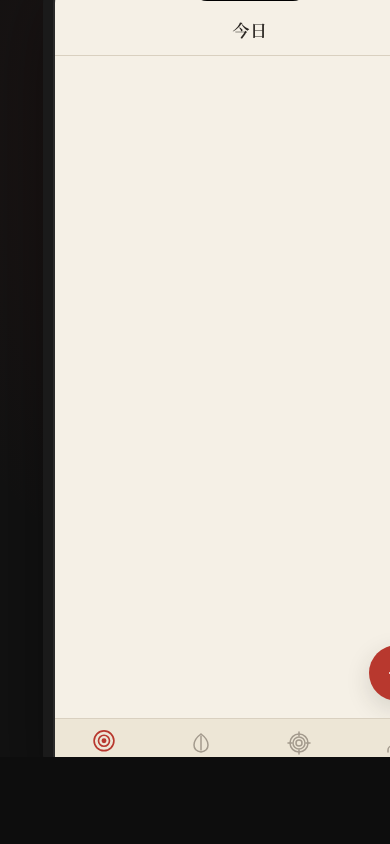

# 弓道志·传统射箭训练日志

形态：原生 App

## 主题

传统弓道射箭训练日志 — 以「一射一志」为理念，配合弓弦拖拽签名动效将拉弓释放过程转化为数据录入。

## 简介

一个完整多页面的原生 App mock，4 个 Tab（今日训练/历史记录/成就勋章/我的弓道）覆盖射箭训练全流程。核心签名动效是弓弦拖拽：用户拖拽弓弦蓄力，释放时弦振动 + 靶心涟漪，同时力度数据自动写入训练记录。含设计规范页和接口文档页，纯 vanilla 单文件实现。

## 截图展示

## 妙搭预览链接

https://dcniaqwtmoca.feishu.cn/page/Zn9nmAOmOdj1WcaDUbBcNJ3enUd

## 文件说明

| 文件 | 说明 |
|------|------|
| `index.html` | 完整源码（纯 vanilla 单文件，~117KB） |
| `preview.png` | 390×844 手机端截图 |
| `设计规范.md` | 色彩/字体/动效系统规范 |

## 技术栈

- 纯 vanilla HTML/CSS/JS 单文件
- SVG 绘制靶环 + 弓弦
- Touch/Pointer Events 拖拽 + RAF 物理模拟
- localStorage 持久化
- prefers-reduced-motion 降级
