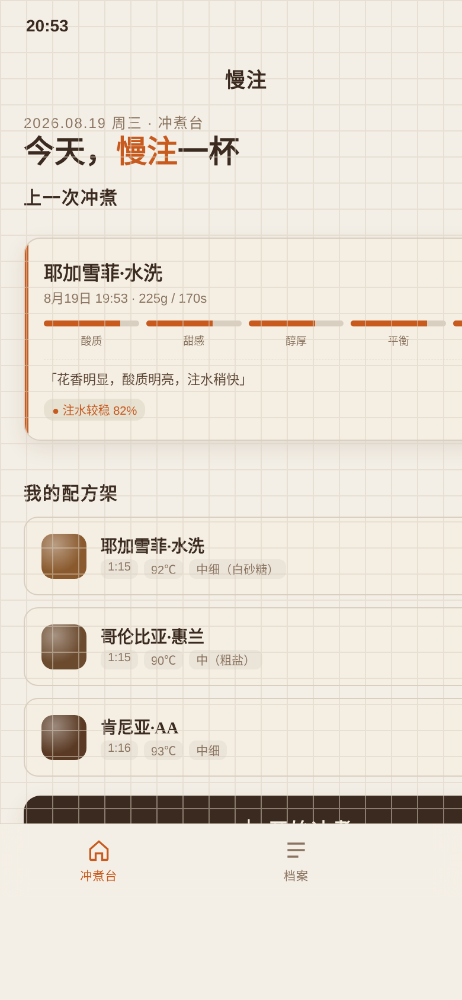

# 慢注 · 手冲咖啡冲煮日志

形态：微信小程序

> 日期：2026-08-19 · 方向：V2 手机 UI · 形态：微信小程序 · 主题：手冲咖啡注水流速练习与冲煮日志小程序

## 简介

「慢注」是一款手冲咖啡**注水流速练习与冲煮日志**微信小程序高保真原型。

核心洞察：手冲咖啡最难掌握的是**注水流速控制**——慢注把它变成可练习、可记录、可复盘的核心机制。拇指按住注水按钮，canvas 实时画出本次累积注水量曲线，与目标配方曲线（虚线）对照；冲完杯测打分入档，档案里能看到自己注水稳定性的进步轨迹。整个 App 是一本「冲煮实验手账」：网格纸背景、精密计量数字、手写注释感。

## 签名动效：注水曲线

冲煮中页：拇指按住「注水」按钮，看着自己的注水曲线在网格纸上实时生长、追着目标虚线走——按住越久流速越大（4.5→~9 g/s），分段节点到点提示，达目标水量自动完成。这是「我在练习手冲」的核心记忆点。

## 核心流程

冲煮台（上次冲煮结果卡 + 我的配方架 + 开始冲煮）→ 配方参数（豆子/粉水比/水温/研磨/注水段）→ 冲煮中（签名注水曲线）→ 杯测评分（五维滑块 + 笔记）→ 存入冲煮档案（历次曲线可叠加对比）。全程因果跳转无死路。

## 截图



冲煮台首屏：上次冲煮结果卡（评分/五维风味/稳定度/笔记）+ 我的配方架（3 款真实咖啡豆）+ 开始冲煮。

## 妙搭预览

https://dcniaqwtmoca.feishu.cn/page/WkTTmGCFWd2Y9DaKPHxc5RXsnDd

## 端侧交互（小程序，7 种）

胶囊自定义导航栏 · 页面栈 push/pop 滑动 · 底部 TabBar · 半屏 ActionSheet · 下拉刷新弹性 · 左滑删除 · 吸底操作栏

## 配色

纸白 #F4EFE6 · 深墨咖 #3A2A1F · 焦糖橙 #C85A1E · 橄榄绿 #5F6B3A · 暖灰线 #D9CFC0 · 红土 #A23B1E（禁蓝紫渐变，与近期作品不雷同）

## 文件说明

```
2026-08-19_慢注咖啡_manzhu-coffee/
├── index.html          完整单文件应用源码（纯 vanilla，无外部依赖）
├── preview.png         冲煮台首页截图（780×1688 @2x）
├── 设计规范.md         产品概念/色彩/字体/动效/签名交互/接口（取自源码真实值）
└── README.md           本文件（含形态标记行）
```

## 技术栈

纯 vanilla 单文件 HTML（无 React / Babel / CDN）。390px 手机壳内渲染，localStorage 持久化冲煮档案，canvas 2D 绘制注水曲线。健壮性：RAF 随页面可见性暂停且卸载取消、快速操作不叠加定时器、高频事件直接操作 DOM、支持 prefers-reduced-motion。

## 自查结论

- Contract Fidelity：FULL（core_idea 注水曲线签名 / must_keep 7种端侧交互+签名canvas+完整UserFlow+3真实配方+localStorage+非模板首屏 / must_not_regress_to 无通用模板/无网页缩进/无假功能，全部实现）
- Browser QA：PASS（5 场景各仅一页激活，0 Console/Runtime Error，签名 canvas 渲染目标曲线，截图非空白）
- Critic：无 CRITICAL/MAJOR，Contract Fidelity FULL，产品逻辑成立（注水练习真实机制）、Core Flow 完整无死路、无假功能、首屏非通用模板
- Quality Gate：PASS（Product Logic 18 / User Flow 18 / Mobile Interaction 13 / IA 13 / Tech 4，CRITICAL=0）
- 工程修复记录：1 次 ENGINEERING_REPAIR——setPageActive 非栈页面未加隐藏类导致多页叠层，已修复并重新发布验证
- 反模板：首屏=冲煮台（上次冲煮结果卡+配方架+开始冲煮），非问候+搜索+Banner 模板；手冲咖啡题材近 20 版首现；现代生活方式题材打破作品集传统手工艺同质化

> 等待协调者检查后提交 GitHub。
