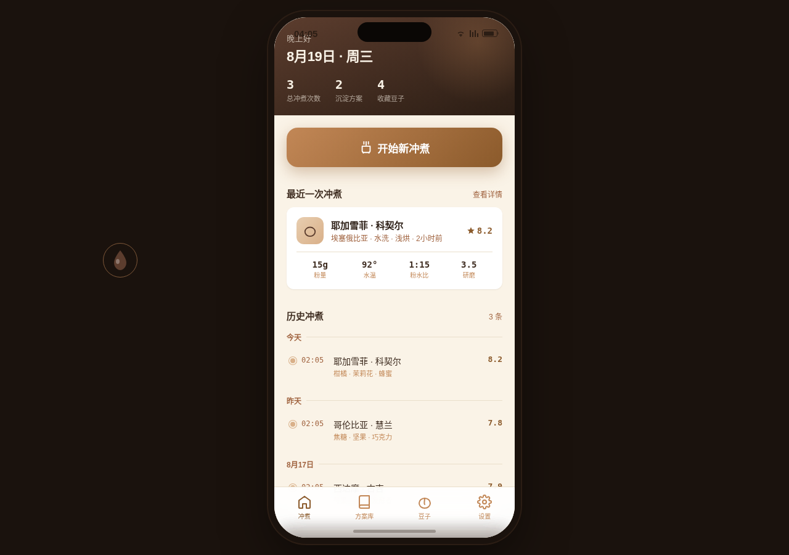

形态：原生 App

# 手冲咖啡冲煮日志 V2 · 手机端 Mock

主题：工具型手冲咖啡冲煮记录 App，选豆→记录参数→注水节奏→风味评分→方案库复现。

## 简介
面向咖啡爱好者的手冲冲煮记录工具。首页是"当前进行中的冲煮会话"+ 拇指可达的「开始新冲煮」大按钮 + 历史冲煮时间线。核心流程：选豆（耶加雪菲/西达摩/哥伦比亚/曼特宁）→ 记录粉量/水温/粉水比/研磨度 → 注水节奏时间轴（拖动分段节点，水流粗细/流速实时变化）→ 5 维风味雷达评分 → 存入方案库 → 可「按此方案冲煮」复现。含设计规范页与接口文档页。localStorage 持久化。

## 截图

## 妙搭预览链接
https://dcniaqwtmoca.feishu.cn/page/OUe9mzKa9dRXDlaiyhkcYRWFnpv

## 文件说明
- `index.html` — 纯 vanilla 单文件源码
- `设计规范.md` — 色彩/字体/空间/动效系统
- `preview.png` — 1280×900 桌面截图（手机样机居中）
- `thumbnail.png` — 妙搭缩略图

## 技术栈
纯 vanilla 单文件 HTML，模拟原生 App 390px 容器居中。无外部依赖。自定义光标 RAF 阻尼跟随，支持 prefers-reduced-motion。

## 设计母题
手冲咖啡工坊——工具型单任务流，区别于通用 App 首页模板。深烘焙棕 + 焦糖琥珀 + 奶咖米 + 豆绿四色体系。
