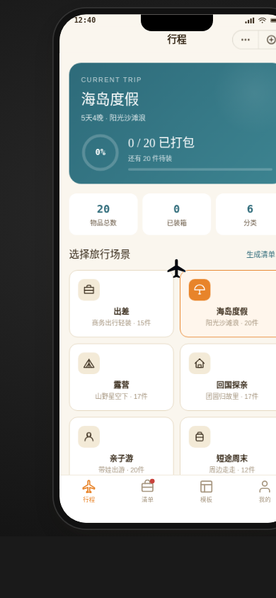

# 旅行打包手账 · V2 手机 UI

形态：微信小程序

---

## 主题

一款出门前即用即走的旅行行李打包清单微信小程序。选旅行场景 → 自动生成物品清单 → 逐项拖物「装箱」→ 出门前拉链封箱 → 存为模板下次复用。

## 简介

- **产品机制**：选场景 → 生成清单 → 拖物装箱 → 封箱总检 → 存模板，完整出行准备闭环
- **首屏模型**：当前行程打包进度环 + 6 种旅行场景选择，非通用首页模板（无问候语/搜索/Banner）
- **签名交互**：① 拖动物品贴纸到行李箱区域「装箱」（物品飞入吸附 + 进度环填充 + 打勾变灰）；② 全部装完后横滑拉链封箱，登机牌「READY TO GO · 行李已就绪」弹出
- **记忆点**：封箱那一刻——拉链从左拉到右、箱子咔哒合拢、登机牌弹出
- **持久化**：当前行程进度 / 自建模板 / 已完成行程存入 localStorage，刷新保留

## 截图

> 首屏行程页：当前行程打包进度环 + 6 种旅行场景选择卡。

## 妙搭预览

https://dcniaqwtmoca.feishu.cn/page/GMTRmrdbkdWVawagz68c4CMlnhe

## 4 Tab 信息架构

| Tab | 内容 |
|-----|------|
| 行程 | 当前行程总览 + 打包进度环 + 6 场景选择（出差/海岛度假/露营/回国探亲/亲子游/短途周末） |
| 清单 | 物品贴纸墙 + 行李箱装载区，拖物装箱 + 封箱出门 |
| 模板 | 内置场景模板 + 自建模板（空状态有引导） |
| 我的 | 用户信息 + 已完成行程 + 设计规范入口 + 接口文档入口 |

## 微信小程序端侧交互（7 种，均真实可用）

1. 自定义导航栏 + 右上胶囊按钮
2. 底部 TabBar（4 Tab，红点提示）
3. 页面栈 push/pop 横滑转场
4. 半屏弹层 ActionSheet（物品详情 / 数量调整）
5. 下拉刷新弹性回弹
6. 左滑操作（清单项删除 / 编辑）
7. 吸底操作按钮（封箱出门）

## 真实内容

6 种旅行场景，每种生成对应物品清单（共 15 项），分 6 类：证件（护照/身份证/机票）、电子（充电器/数据线/转换插头/充电宝）、洗护（洗漱包/防晒霜）、衣物（换洗衣物/泳衣）、药品（常用药/肠胃药）、专项（露营睡袋/儿童安抚物等随场景变化）。无 Lorem Ipsum。

## 配色

牛皮纸暖棕 `#C8A06A` + 贴纸明橙 `#E8842A` + 登机牌墨青 `#2E6B7A` + 奶白底 `#FAF6EE` + 警示朱红 `#C8423B` + 进度松绿 `#5B9A6A`。暖橙主导，明亮、非蓝紫渐变。视觉来源：旧行李箱贴纸墙 + 登机牌 + 行李标签。

## 文件说明

| 文件 | 说明 |
|------|------|
| `index.html` | 单文件应用（HTML + CSS + JS 全内联，纯 vanilla） |
| `设计规范.md` | 色值 / 字体 / 尺寸 / 动效系统 / 组件 / 技术栈 |
| `preview.png` | 首屏截图（390×844） |

## 技术栈

纯 vanilla 单文件 HTML，无 React / 无 Babel / 无 CDN / 无外部图片 / 无外部字体。localStorage 持久化。RAF / 定时器随 `visibilitychange` 暂停且卸载取消，支持 `prefers-reduced-motion`。零未定义引用，零 Console Error。

## 设计规范页 / 接口文档页

在小程序「我的」Tab 可进入二级页：
- **设计规范页**：真实色值、字体、间距、动效系统
- **接口文档页**：REST API 端点（`GET /api/trip/scenarios`、`POST /api/trip/create`、`POST /api/trip/pack`、`GET /api/templates`、`POST /api/templates`、`GET /api/history`），含请求 / 返回示例

## 形态交替说明

上一次 phone_mock 作品「百子柜·调香」为原生 App，本版交替为微信小程序。
