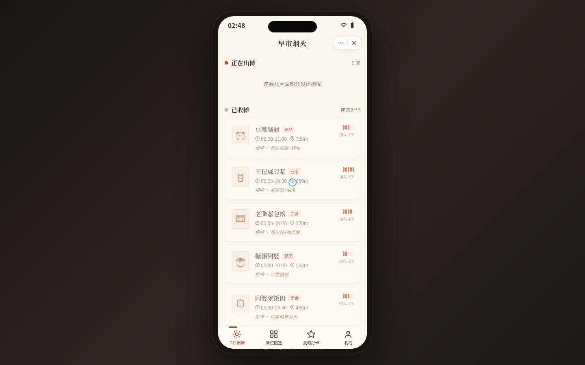

# 早市烟火

形态：微信小程序

> 首屏即回答「现在哪里还出摊」——按出摊时段实时状态组织的城市早餐摊图鉴，半屏弹层看详情，盖章打卡沉淀个人口味日志。

## 主题
城市早餐摊 · 手机 UI（Phone Mock）

## 简介
一款微信小程序形态的早餐摊图鉴。首屏按当前实时时间把摊位分成「正在出摊 / 即将收摊 / 已收摊」三组，让早八用户 30 秒内找到今天还来得及吃的摊子。点摊位卡滑出半屏弹层看详情（出摊时间、位置、招牌、排队热度、摊主特色），吸底「盖章打卡」按钮触发朱红印章下落、震感回弹、纸面晕墨的签名动效，打卡写入 localStorage 沉淀成个人口味日志，可在「我的打卡」左滑删除。10 个真实感南方城市早餐摊，早市/夜摊时间差异让出摊状态真实变化。

## 截图

## 妙搭预览链接
https://dcniaqwtmoca.feishu.cn/page/Rfa2mVegqdMc24apY3dcZ5BInYg

## 形态标记
**形态：微信小程序**（胶囊按钮 + 自定义导航栏 + 页面栈 push/pop + 底部 TabBar + 半屏弹层 + 下拉刷新弹性 + 左滑删除 + 吸底操作栏）。

## 核心流程
今日出摊选摊位 → 半屏弹层详情 → 盖章打卡（签名动效）→ localStorage 持久化 → 我的打卡回顾 / 左滑删除。含设计规范页与接口文档页（「我的」Tab 进入）。

## 文件说明
| 文件 | 说明 |
| --- | --- |
| `index.html` | 单文件完整实现（HTML+CSS+JS 内联，SVG 手绘食物图标） |
| `设计规范.md` | 色彩 / 字体 / 尺寸令牌 / 动效规范（色值自源码提取） |
| `preview.png` | 页面截图 |
| `thumbnail.png` | 应用缩略图 |

## 技术栈
纯 HTML + CSS + JS（单文件内联）· SVG 食物图标 · 允许 Google Fonts（Noto Serif SC / Noto Sans SC）· 纯 localStorage 持久化（key `zaoshi_yanhuo_checkins`）· 390×844 手机壳 · 支持 prefers-reduced-motion。

## 配色
灶火橙红 `#C8401F` + 米白 `#FAF6EE` + 酱褐 `#5A3A28` + 蒸汽白 `#FFFCF5`（无蓝紫渐变）。
