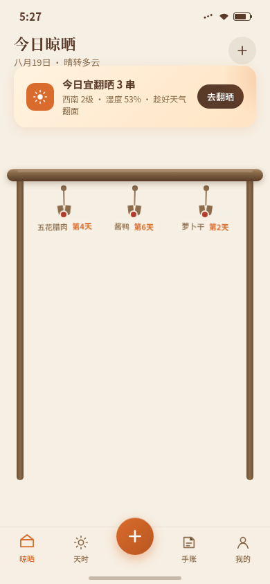

# 晒秋 · 家庭风物晾晒助手

**类别**：Phone Mock　**日期**：2026-08-19　**形态**：原生 App

## 形态交替说明
上一版（2026-08-19 街角修理铺）为微信小程序，故本版做原生 App 形态，遵循交替规则。

## 简介
管理阳台风物晾晒的原生 App：腊肉、酱鸭、萝卜干、鳗鲞、柿饼挂在自家晾晒架上，App 围绕「挂晒 → 看天翻晒 → 观察变化 → 收成分装」的真实时间流展开。首屏就是今日晾晒架——每串风物随天数改变色泽与油润度，随天气建议翻晒。

## 截图

## 妙搭预览
https://dcniaqwtmoca.feishu.cn/page/Q7i7mYcLWdOjRuaqa23czPk4nQb

## 文件说明
| 文件 | 说明 |
|---|---|
| index.html | 入口 HTML（15.1KB） |
| app.css | 样式（40.6KB） |
| app.js | 逻辑（62.8KB，含翻晒/时光拨盘/失水曲线/收成分装） |
| 设计规范.md | 设计母题、色彩体系、核心流程、签名动效、接口文档、健壮性红线 |
| preview.png | Browser QA 截图（390×844 首屏） |
| thumbnail.png | 平台缩略图 |

## 技术栈
- HTML + CSS + 原生 JS（vanilla）
- localStorage 持久化晾晒记录与手账
- Canvas 绘制失水率曲线
- requestAnimationFrame + visibilitychange 暂停
- prefers-reduced-motion 降级
- 无横向溢出（390 / 360 双尺寸通过）

## 核心流程（完整可走通）
1. 新建晾晒：选品类 → 重量 → 盐度 → 挂晒日
2. 每日翻晒打卡：按住风物上滑翻面
3. 风干进度：失水率 S 型曲线
4. 收成分装入库

## 签名动效：时光拨盘
腊肉详情页拖动天数滑块，肉色从鲜红渐变到琥珀透亮、表面析出盐霜。

## 设计要点
- 产品机制（时间+天气驱动晾晒）全库首次
- 首屏反模板：晾晒架而非问候+搜索+Banner
- 原生 App 形态：状态栏 + 底部 TabBar + 堆栈 push/pop，禁胶囊按钮等小程序元素
- 含设计规范页 + REST /api/v1 接口文档页
- 禁蓝紫渐变；秋阳暖调（谷壳米白/柿橙/酱色深棕/柏木/晒场红/天青灰）
