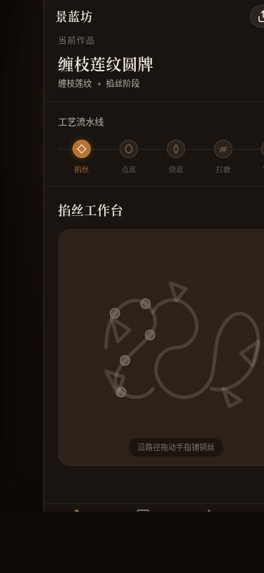

形态：微信小程序

# 景蓝坊 · 掐丝珐琅手作志（微信小程序）

> 日期：2026-08-19 · 方向：V2 手机 UI · 形态：微信小程序 · 主题：掐丝珐琅工艺手作志

## 简介

「景蓝坊」是一方随身携带的珐琅工坊。选一个传统纹样起一件作品，亲手沿路径描铺铜丝、点填宝石色珐琅釉、看炉火烧制、磨出光泽、镀金成器，慢慢攒成自己的珐琅作品集。五阶段工艺流水线——掐丝→点蓝→烧蓝→打磨→镀金——每阶段有真实交互与进度记录，阶段间因果递进。

设计语言来自景泰蓝工坊的铜丝、珐琅釉料、炉火与金箔（暗栗漆底 + 铜色 + 炉火橙 + 珐琅宝石色 + 金），刻意避开近期手作类的暖纸朱砂木器陶土气质。签名交互为掐丝路径描丝——沿图样轮廓拖动，铜色笔触实时跟随生成，路径闭合闪金属高光——取代已饱和的「印章/拖拽上秤」签名族。

## 核心产品逻辑

- **工坊（首页）**：当前作品工艺流水线进度条（掐丝→点蓝→烧蓝→打磨→镀金，当前阶段铜色脉动高亮）+ 当前阶段工作区
- **掐丝**：沿 SVG 路径拖动描铺铜丝（stroke-dasharray 实现），经过节点振动反馈，闭合闪金属高光，进度百分比实时更新
- **点蓝**：点击图案区域循环切换 5 种种珐琅釉色（钴蓝/松石绿/胭脂红/鸡油黄/翠玉绿）
- **烧蓝**：拖动温度滑块（200-1000℃），火焰 SVG 动画，800℃ 为最佳烧制温度，需反复烧 3 次
- **打磨**：Canvas 磨砂层，摩擦渐进显光泽，实时采样估算光泽度
- **镀金**：金色渐变完成动画，作品标记为已完成
- **作品**：全部作品列表（进行中+已完成），点击半屏弹层看详情，左滑删除/归档，下拉刷新
- **图样**：6 种传统纹样网格（牡丹纹/缠枝莲纹/宝相花纹/海水江崖纹/祥云纹/回纹），点击新建作品
- **我的**：工艺统计、工具釉料库存、设计规范页入口、接口文档页入口

## 截图

## 妙搭预览

https://dcniaqwtmoca.feishu.cn/page/WLP2mZfSydUGKqadCkEc81OHnse

## 文件说明

| 文件 | 说明 |
|------|------|
| index.html | 纯 vanilla 单文件 HTML 源码（3190 行） |
| preview.png | 首屏截图（375×812） |
| 设计规范.md | 完整设计规范（色值/字体/动效/内容） |
| README.md | 本文件 |

## 技术栈

- 纯 vanilla 单文件 HTML（无 React/Babel/CDN/外部 JS/CSS）
- SVG 路径绘制纹样 + stroke-dasharray 实现掐丝描丝
- Canvas 实现打磨磨砂层
- localStorage 持久化作品进度和阶段状态
- 触摸/指针事件
- 支持 prefers-reduced-motion（动画降级为静态/瞬切）
- RAF 随页面可见性暂停且卸载取消

## 微信小程序端侧交互（6 种）

1. 胶囊导航栏（顶部自定义导航栏 + 右上角胶囊按钮）
2. 底部 TabBar（4 Tab）
3. 半屏弹层（从底部滑出，可下滑关闭）
4. 下拉刷新（列表页下拉弹性回弹）
5. 左滑操作（列表项左滑露出删除/归档）
6. 页面栈 push/pop（进入详情/规范/接口为覆盖动画，返回 pop）
