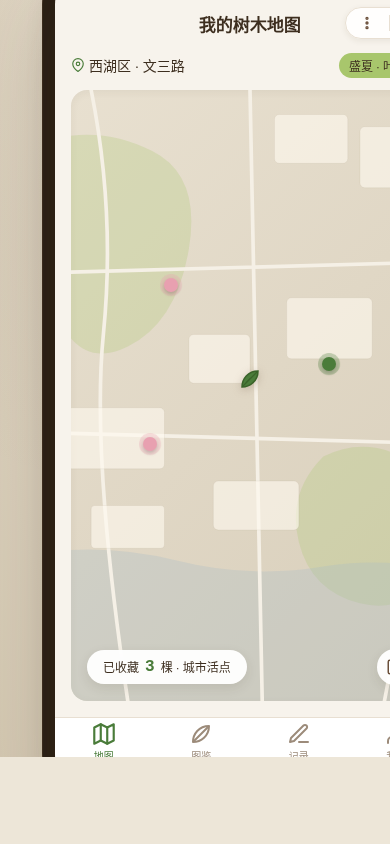

# 树下·城市树木图鉴 微信小程序

形态：微信小程序

## 项目概述

「树下」是一款城市树木图鉴与物候记录微信小程序。让散步时身边匿名的行道树，变成有名有姓、可追踪四季变化的活地图。

- 产品形态：微信小程序（胶囊按钮 + 自绘导航栏 + 底部 TabBar + 半屏弹层 + 下拉刷新 + 左滑操作）
- 核心流程：发现树木 → 识别/查看 → 收藏到我的树木地图 → 记录物候观察
- 母题：「城市的树是一张活的地图」，每棵被收藏的树都是地图上随季节变化的活点

## 在线预览

> [树下 · 城市树木图鉴](https://dcniaqwtmoca.feishu.cn/page/Kj1WmUUvldLi2Vao0rncS0ranib)

## 截图



## 文件结构

```
├── index.html              # 主入口（手机框内小程序模拟）
├── 设计规范.md             # 视觉与交互设计规范
├── preview.png             # 390×844 手机端截图
└── README.md               # 本文件
```

## 技术说明

- 纯 HTML + CSS + 原生 JavaScript（vanilla），零外部依赖
- 手机框 390×844 视口模拟微信小程序形态
- localStorage 持久化收藏与物候记录
- 系统字体栈，无外部字体依赖
- 支持 prefers-reduced-motion

## 端侧交互语言

1. 胶囊按钮 + 自定义导航栏容器（右上角胶囊）
2. 底部 TabBar（地图 / 图鉴 / 记录 / 我的，共 4 Tab）
3. 半屏弹层 ActionSheet（点树→半屏滑出详情）
4. 下拉刷新弹性回弹
5. 左滑操作（列表项左滑出删除/取消收藏）

## 签名动效

收藏一棵树时，地图上从该位置冒出一片对应季节的小叶/花瓣，飘落到活点位置并变成常驻标记；物候阶段变化时活点颜色随季节切换。

## 包含内容

- 10 种真实城市树木（银杏/香樟/悬铃木/桂花/樱花/玉兰/栾树/鹅掌楸/合欢/石榴）
- 完整物候阶段枚举（发芽/展叶/开花/结果/变色/落叶/常绿）
- 设计规范页 + 接口文档页
