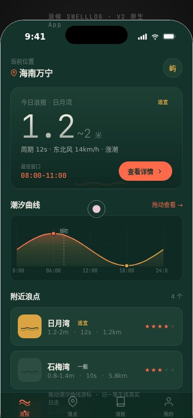

# 浪候 SWELLLOG · 冲浪浪况与出浪日志 App

形态：原生 App

> 日期：2026-08-19　|　类别：Phone Mock　|　Art Orchestrator batch12

## 简介
一个冲浪者的「看浪 + 记浪」原生 App：首页回答"今天值不值得下海"，核心动作是拖动潮汐曲线找到最佳下水窗口，出浪后「记一笔」形成个人浪点档案。完整 User Flow：浪报 → 浪点详情 → 记一笔 → 浪账。

## 设计观点
冲浪最独特的信息是潮汐/涌浪/风的时间性。潮汐曲线游标既是签名交互，又承载核心产品价值；避开了社区/课程/电商三类模板，产品机制从冲浪者真实行为生长。

## 截图

## 妙搭预览
https://dcniaqwtmoca.feishu.cn/page/FxKhmmfCrdLmFMakpz1cs6DPnRb

## 页面（6 页）
1. 浪报首页（今日浪况总览 + 附近浪点）2. 浪点详情（潮汐曲线游标 + 逐时表 + 风/涌向罗盘）3. 记一笔（半屏弹层表单）4. 我的浪账（日志时间线 + 板型库）5. 设计规范页 6. 接口文档页

## 文件说明
- `index.html` — 入口
- `components/` — React 组件（app/main/pages/tidal/ios-frame/tweaks-panel/data）
- `设计规范.md` — 色值/字体/动效系统
- `preview.png` — 390×844 首屏截图

## 技术栈
React 18 + Babel standalone（浏览器内编译 JSX，经飞书 CDN 加载）。localStorage 持久化日志。自定义光标、prefers-reduced-motion 降级、RAF 随可见性暂停。

## 自查
首页即今日浪况总览（无问候语/Banner 模板）；记一笔提交后日志真实出现在浪账；游标阻尼+吸附+连续联动；拇指区布局；页面间因果跳转闭环。

## 形态交替
上一次（旧书体温计）= 微信小程序 → 本次 = 原生 App。
