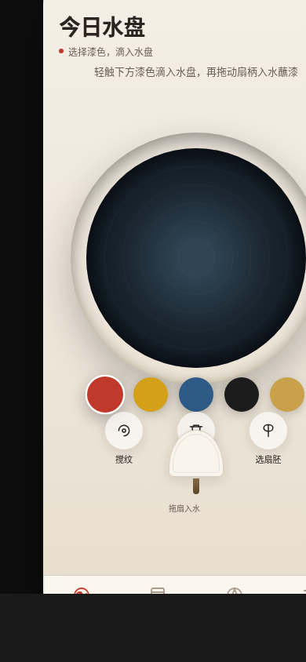

形态：原生 App

# 漆扇手作志 · V2 手机 UI

> 一款模拟传统漆扇漂漆工艺的手作原生 App。  
> 滴漆入水 → 搅出纹理 → 拖扇蘸漆 → 提扇显纹 → 晾干命名 → 入扇册。



## 🎨 主题

**漆扇手作志**——整个界面是一张正在被制作漆扇的水盘工作台。用户选扇胚、调漆色、漂漆入水搅出纹理、拖扇入水蘸漆、提扇瞬间漆纹转印显形，每把漆扇独一无二，配方可记录复现。

## ✨ 核心亮点

- **签名动效：提扇显纹** — 扇面从水盘被提起的瞬间，水面漂浮的漆纹按提拉速度转印到扇面，朱砂与松烟拉出独一无二的纹路，金箔碎点贴附
- **真实工艺** — 5 种大漆色（朱砂红 / 石黄 / 石青 / 松烟墨 / 金箔）、3 种扇胚（素白团扇 / 生绢团扇 / 油纸折扇）、真实工艺参数
- **提拉速度影响纹样** — 快提拉 = 细密拉丝，慢提拉 = 大片晕染
- **扇册持久化** — localStorage 保存所有成品，配方复现，删除管理
- **原生 App 体验** — TabBar / 半屏弹层 / 下拉刷新 / 返回手势 / 拖拽交互

## 📱 形态标记

**形态：原生 App**

- 状态栏 + 自定义导航栏 + 底部 TabBar
- 半屏弹层 Bottom Sheet
- 页面栈 push/pop 转场机制
- 左边缘返回手势
- 下拉刷新弹性
- 毛玻璃 TabBar

上一版（2026-08-19_岸钓战术板）为微信小程序，本版交替为原生 App。

## 🎯 妙搭预览链接

https://dcniaqwtmoca.feishu.cn/page/Qf3gmuMx0df9jzaIzM0c612onrJ

## 📂 文件说明

```
2026-08-19_漆扇手作志_lacquerfan-atelier/
├── index.html         # 主文件（单文件 vanilla HTML）
├── 设计规范.md         # 设计规范文档（色彩/字体/动效/组件/页面）
├── README.md          # 本文件
└── preview.png        # 预览截图
```

## 🛠 技术栈

- **纯 Vanilla HTML** — 单文件，无构建步骤
- **原生 CSS** — CSS 变量 + Flex/Grid，无 CSS 框架
- **原生 JS** — 无框架、无外部依赖、无 CDN
- **Canvas 2D** — 水盘漆色渲染 + 扇面转印效果
- **localStorage** — 扇册数据持久化
- **Touch Events** — 拖拽、下拉刷新、返回手势、Tab 滑动切换

## 🎮 操作指南

### 今日水盘
1. 点击底部色卡，向水盘滴入漆色（可叠加多种颜色）
2. 点击「搅纹」按钮搅拌出纹理（可选）
3. 点击「选扇胚」切换扇胚类型
4. 拖动底部扇柄入水蘸漆
5. 向上拖动提扇 — 提拉速度影响纹样疏密
6. 晾干后命名入扇册

### 扇册
- 查看所有已制作的漆扇，双列网格展示
- 下拉刷新
- 点击查看详情 / 复现配方 / 删除

### 色谱
- 大漆五色详细介绍
- 三种扇胚说明
- 工艺参数参考

### 规范
- 设计规范页（色彩 / 字体 / 动效 / 组件）
- 接口文档页（扇册 / 配方 API + 数据结构）

## 🎨 配色

| 色名 | 色值 |
|------|------|
| 朱砂红 | `#C0392B` |
| 石黄 | `#D4A017` |
| 石青 | `#2E5A88` |
| 松烟墨 | `#1C1C1C` |
| 金箔 | `#C9A14A` |
| 宣纸白 | `#F5EFE6` |
| 水盘深青 | `#1a2630` |

禁蓝紫渐变，以大漆颜料色为主，宣纸米白为底。

## ✅ 自查清单

- [x] 原生 App 形态（非小程序，无胶囊按钮）
- [x] 完整 user flow：水盘 → 选扇胚 → 滴漆 → 搅纹 → 拖扇 → 提扇 → 晾干 → 命名 → 扇册
- [x] 提扇显纹签名动效，速度影响纹样疏密
- [x] 5 种大漆色 + 3 种扇胚，真实工艺参数
- [x] localStorage 持久化
- [x] ≥ 4 种原生端侧交互（TabBar / Bottom Sheet / 下拉刷新 / 返回手势 / 拖拽）
- [x] 设计规范页 + 接口文档页
- [x] 纯 vanilla 单文件 HTML，无外部依赖
- [x] 禁蓝紫渐变
- [x] 内容真实，非 Lorem Ipsum
- [x] 390px 布局正常
- [x] 支持 prefers-reduced-motion
- [x] 灰度下层级仍成立
