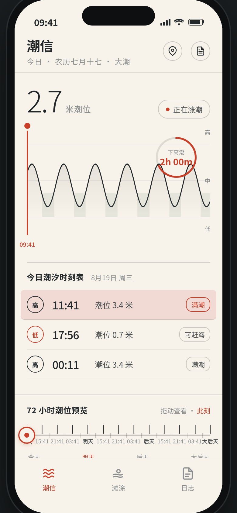
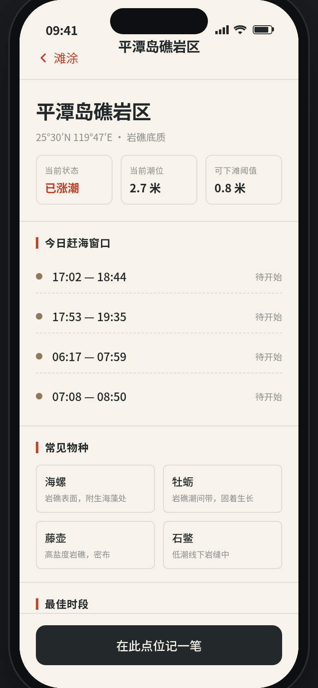
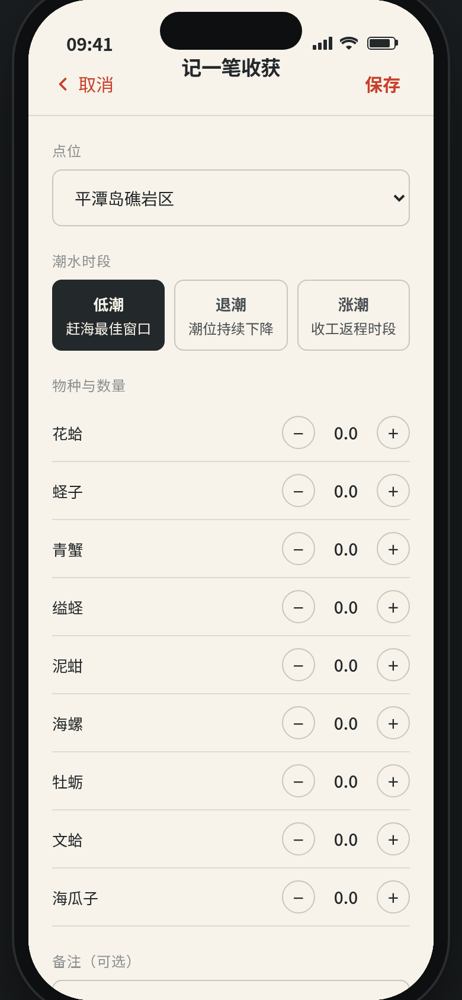

形态：原生 App

# 潮间带 Intertidal · 赶海潮信 App

> 方向：V2 手机 UI · 形态：原生 App · 日期：2026-08-19 · 主题：沿海赶海潮信工具

## 简介

沿海赶海人的潮信工具原生 App。把老式《潮信表》铅印小册子搬进手机：首页一张占据视觉中心的今日潮汐大曲线，朱砂指针指向当前时刻，低潮赶海窗口以倒计时环呈现——打开 3 秒就能回答「今天几点能下滩」。

核心流程：打开看今日窗口 → 选滩涂点位（按当前潮位实时标注可下滩/退潮中/已涨潮）→ 赶海后记一笔收获（物种/数量/点位/潮水时段）→ 月历与统计回看。拖动底部 72h 时间尺，潮位、窗口倒计时、点位状态灯全部联动重算。

## 妙搭预览

https://dcniaqwtmoca.feishu.cn/page/JDaAmiygzdfoKmaSq9jcPeIcnXd

## 截图展示

### 首页 · 潮信

### 滩涂 / 日志 / 点位详情 / 记一笔

## 文件说明

| 文件 | 说明 |
|------|------|
| index.html | 纯 vanilla 单文件源码（HTML+CSS+JS），零外部框架依赖 |
| 设计规范.md | 设计理念、色板、字体、页面结构、签名动效系统 |
| preview.png | 首页潮信截图（390×844） |
| qa_screens/ | Browser QA 各页交互截图 |
| thumbnail.png | 应用缩略图 |

## 技术栈

纯 vanilla HTML/CSS/JS 单文件实现（无 React/Babel/构建工具），外部依赖仅 miaoda 镜像 Noto Sans SC 字体。数据用 localStorage 持久化收获记录，潮汐曲线用 SVG 精确绘制，定时器随页面可见性暂停、卸载取消，支持 prefers-reduced-motion。

## 设计自查

- 首页即潮汐曲线仪表盘，非 Greeting+Search+Banner 模板 ✓
- 配色纸白/墨色/朱砂/滩涂褐/海苔绿，无蓝紫 ✓
- 真实内容：福建沿海 6 点位（小埕/罗源湾/平潭/崇武/古雷/东山岛）+ 真实物种（花蛤/蛏子/青蟹/海螺/牡蛎）+ 农历大小潮半日潮逻辑 ✓
- Browser QA：0 console error / 0 失败请求 / 无横向溢出 / 3 Tab + 点位详情 + 记一笔全可用 / 截图均非空白 ✓
- Contract Fidelity：FULL（core_idea 全部实现）· Quality Gate：PASS（CRITICAL=0）
