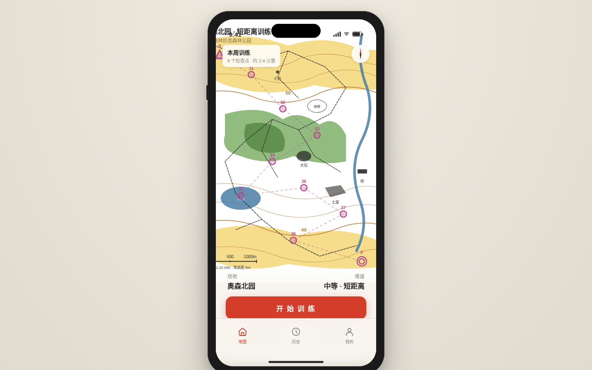

形态：原生 App

# 点签 DianQian · 定向越野训练伴侣

> 日期：2026-08-19 · 方向：V2 手机 UI · 形态：原生 App · 主题：定向越野（Orienteering）
> 妙搭预览：https://dcniaqwtmoca.feishu.cn/page/NMgJmfltidtOESaHeWacgp2EnVg

## 简介

「点签」是一款定向越野训练伴侣原生 App mock，把一次定向训练完整装进口袋：**领图 → 打点 → 交卷**。

打开 App 第一眼是本周训练场地的 IOF 国际定联五色地形图（白树林 / 绿植被 / 黄空旷 / 棕等高线 / 蓝水系 / 黑人造物），地图上标注 8 个检查点（代号 31-38）、起点三角、终点双圈、磁北线、比例尺 1:10000、等高距 5m。点「开始训练」进入打点流程：半屏弹层查看检查点说明表（真实定向术语地物描述），逐个点签打卡——点签器压下「嘀」+ 打卡纸条对应格打出针孔阵列 + 分段时间实时写入。8 点打完生成成绩条（总时长/平均/8 段 splits，最快绿、最慢棕红高亮），保存写入 localStorage 历史。

设计语言来自定向运动独有的真实物件：IOF 五色地图、点签器、打卡纸条。色彩承担地图语义而非装饰，灰度下明度分层仍成立。刻意避开通用 4-TabBar 首页模板，采用地图优先首页 + 3 项底部工具条 + 页面栈导航。

## 签名交互

**点签打卡瞬间**：按下「点签」→ 按钮回弹 + 白闪 + 指北针红脉冲 + 1200Hz「嘀」+ 打卡纸条格子出现针孔阵列 + 成绩条同时长出新的一段。

## 屏幕清单（8 屏，页面栈 push/pop）

1. **地图首页** — IOF 五色 SVG 定向地图 + 场地信息 + 开始训练 / 检查点说明 / 历史成绩
2. **检查点说明表** — 半屏弹层，8 行代号+地物描述（小径交叉口/大石南脚/土崖下…），可下滑关闭
3. **打点流程** — 当前第几点/共8点、实时计时、目标代号脉冲光环、点签按钮、打卡纸条逐格打孔
4. **成绩条** — 打卡纸条式卡片，8 段时间条生长动画，最快/最慢高亮，保存成绩/重打本次
5. **历史** — 成绩条卡片列表，左滑删除，点开看分段详情
6. **我的** — 累计训练/总打点/最快单分段/本月热力小格
7. **设计规范** — IOF 色板 + 字体规范 + 动效说明
8. **接口文档** — 4 个假接口契约（/api/mobile/v2/*）含请求/响应示例

## 文件说明

| 文件 | 说明 |
|------|------|
| `index.html` | 单文件应用（HTML+CSS+JS，零外部依赖，111KB） |
| `preview.png` | 首页地图截图 |
| `设计规范.md` | 色彩/字体/动效/状态/接口完整规范 |

## 技术栈

- 纯 vanilla 单文件 HTML（无 React / Babel / CDN），系统字体 + Web Audio + 内联 SVG
- localStorage 持久化（`dianqian_history`）
- `visibilitychange` 暂停计时器、`punchLock` 防连点、`prefers-reduced-motion` 全量降级
- 妙搭 html 应用，开发态与发布态同链

## 自查结论

- 浏览器 QA（chromium headless）：无 console error、无 404、无横向溢出、截图非空白（像素 std 45.74）
- 端到端流程验证：startTraining → 8 次点签（pointer 事件）逐点推进 31→38 → finishTraining → 成绩条 → saveResult 写入 localStorage，全程零异常
- Contract Fidelity：FULL（原生 App 形态 / 地图优先首页 / 完整闭环 / 真实定向内容 / 规范+接口页 全部达成）
- Critic：CRITICAL=0、MAJOR=0；MINOR 仅 1 项（点签按钮走 pointer 事件、无 onclick 键盘回退，触屏 mock 可接受）
- Quality Gate：PASS（Product Logic 18 / User Flow 19 / Mobile Interaction 13 / IA 13 / Technical 5，CRITICAL=0）

等待协调者检查后提交 GitHub。
