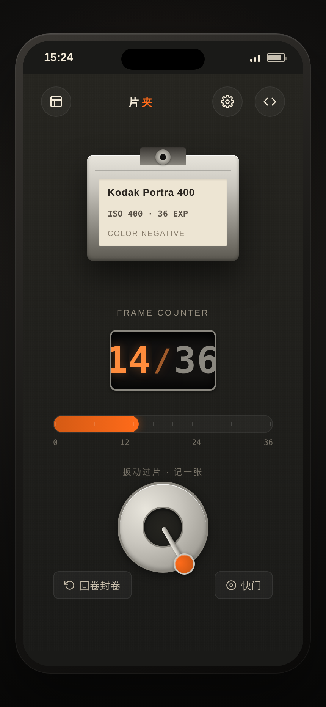

# 片夹 · 胶片摄影在拍胶卷管理原生 App

形态：原生 App

> 一卷正在相机里的胶卷，从装卷到归档的全生命周期管理工具。

## 简介

「片夹」是胶片摄影者的随身工具。核心对象是一卷正在相机里的 35mm 胶卷：装卷 → 每按一次快门过片记一张（光圈/快门/备注）→ 36 张拍满回卷 → 送冲扫看进度 → 底片入袋归档可回看。

打开即见当前在拍卷与剩余张数，单手拇指 3 秒内完成「记一张」。整件作品以相机机身语言为视觉根基——黑色荔枝纹皮革、金属银、镜头刻度橙、奶白刻度字、等宽数字。材质贯穿全局：计数器、拨轮、刻度尺都按相机部件语义设计。

## 截图展示

首页（相机背）：当前在拍卷 Kodak Portra 400 · 机械计数窗 14/36 · 张数刻度条 · 过片扳手 · 回卷封卷/快门按钮。

## 妙搭预览链接

https://dcniaqwtmoca.feishu.cn/page/GKETmRjB9dZcnRahNMecG6Jvnbb

## 签名交互

**过片瞬间**——按住底部过片扳手右拨（或点击），触发：
1. 扳手 60° 机械阻尼回弹
2. 快门帘纵向先合（80ms）露 4px 橙光缝、后开（120ms）
3. 机械计数器滚字翻动 +1
4. 弹出参数速记半屏卡：光圈拨轮（f1.4–f22）/ 快门拨轮（1/8–1/2000）/ 备注输入，保存写入本张记录

这是整件作品要被记住的视觉记忆点：把"过片记一张"这个胶片摄影最高频的动作，做成了有机械重量的单手操作。

## 页面清单（完整 user flow）

1. **首页 / 相机背** — 当前在拍卷暗盒 + 机械计数窗 + 张数刻度条 + 过片扳手 + 回卷封卷/快门；空状态引导装卷
2. **装卷页** — 选胶片型号（6 款真实型号）+ ISO + 装入相机
3. **参数速记半屏卡** — 过片后弹出，光圈/快门拨轮 + 备注，保存写入本张
4. **回卷页** — 满 36 张触发，回卷动画 + 封卷 + 进入待冲扫
5. **卷库页** — 所有胶卷列表（在拍/待冲扫/已归档状态）
6. **冲扫进度页** — 状态卡（待寄出/冲洗中/已完成）+ 进度条 + 取件码 + 标记完成
7. **底片归档页** — 已归档卷缩略图网格 + 单张回看（光圈/快门/备注）
8. **设计规范页** — 色值/字体/间距/动效系统/组件清单
9. **接口文档页** — /api/film/* 数据契约（纯前端 localStorage，接口仅作文档）

## 文件说明

| 文件 | 说明 |
|------|------|
| `index.html` | 单文件应用源码（纯 vanilla HTML/CSS/JS，无外部依赖） |
| `设计规范.md` | 从源码提取的真实色值、字体、动效系统、组件清单 |
| `preview.png` | 首页截图 |
| `README.md` | 本文件 |

## 技术栈

- 纯 vanilla 单文件 HTML（无 React / 无外部 CDN / 无外部图片），自包含可部署
- localStorage 持久化（key: `pianjia_film_app_v2`），刷新不丢
- Stack Navigation（页面栈推入推出，禁用 4 TabBar）
- 支持 `prefers-reduced-motion`，RAF 随页面可见性暂停、卸载取消
- 6 款真实胶片：Kodak Portra 400 / Kodak Ektar 100 / Kodak Gold 200 / Ilford HP5 Plus 400 / Fujifilm C200 / Lomography Color 800

## 设计笔记

- **反模板**：禁用 4 TabBar，采用工具型单任务流 + Stack Navigation；禁用问候+搜索+Banner 首页模板；首页=相机背（当前卷大对象）
- **配色规避**：禁蓝紫渐变；与近 20 版暖纸/墨/朱砂/木质配色完全错开，转向相机机身材质（黑皮革+金属银+刻度橙）
- **签名规避**：禁用近期饱和的盖章类签名动效，改用过片扳手 + 机械计数窗滚字 + 快门帘开合
- **核心闭环已验证**：装卷→过片(+1)→参数卡弹出→保存(frame{num,光圈,快门,备注})→回卷→冲扫→归档，全程 localStorage 持久化无断点

## 工程修复记录

1. **快门帘默认态黑屏**：`.shutter-top/bottom` 默认 `flex:1`（闭合覆盖）导致首屏全黑，修正为静止 `flex:0`（敞开），`triggered`=合 / `opening`=开
2. **参数速记卡不可达**：`showParamSheet()` 定义后无任何调用点，在 `triggerAdvance()` 过片后（未拍满时）调用，恢复核心参数记录闭环
