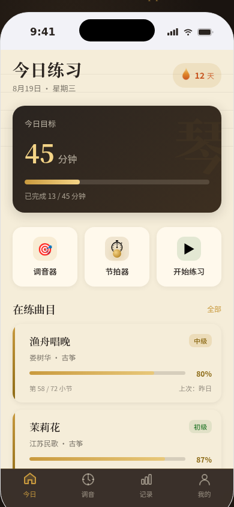

# 琴房 · 乐器练习 App

**类别**：Phone Mock　**日期**：2026-08-19　**形态：原生 App**

乐器练习者每天打开的原生 App：今日练习任务 → 调音 → 节拍 → 计时 → 打卡 → 周回顾，一条真实完整的练习流。签名交互是可拖拽的黄铜节拍摆锤——设定 BPM 后松手，摆锤以真实单摆物理来回摆动，整个界面随节拍呼吸。

## 妙搭在线预览
https://dcniaqwtmoca.feishu.cn/page/DYlOmqhHNdHoPOaBFkicaqeun7b

## 核心体验
- 今日：练习任务与曲目进度（《渔舟唱晚》《茉莉花》《阳关三叠》）
- 调音：弹簧-阻尼指针表盘，进入绿区显示"准了"，六弦切换
- 节拍器：拖拽摆锤设 BPM（40–208），单摆物理摆动 + 节拍脉冲，拍号切换
- 记录：打卡印章落纸，连续天数与本周时长统计
- 我的：设计规范页 + 接口文档页（6 个 API 端点）

## 文件说明
- `index.html` — 完整实现（单文件）
- `设计规范.md` — 色彩 / 字体 / 动效 / 产品逻辑
- `preview.png` — 首页截图（390×844）
- `thumbnail.png` — 应用缩略图

## 技术栈
单 HTML 文件；原生 App 形态（状态栏 + 动态岛 + 底部 TabBar + Home Indicator）；自定义黄铜圆点光标；RAF 随可见性暂停；支持 prefers-reduced-motion。
