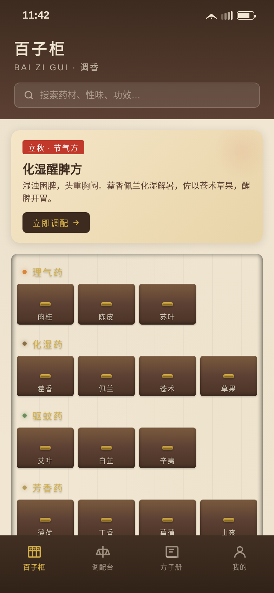
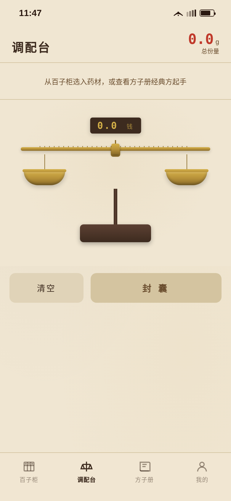

# 百子柜·调香 · V2 手机 UI

形态：原生 App

---

## 主题

一款调配传统中药香囊的原生 App。首屏是一面老药铺百子柜（抽屉墙），拉开抽屉选药材，在戥秤上称量配比，封入香囊并盖朱砂封印，方子存入方子册可复用。

## 简介

- **产品机制**：选药 → 称量 → 封囊 → 存方，完整调配仪式
- **首屏模型**：百子柜抽屉墙（5 组药性分类 × 若干抽屉），非通用首页模板
- **签名交互**：戥秤阻尼摆动称量 + 朱砂封印下落盖印（墨晕扩散）
- **记忆点**：封囊完成的仪式时刻——束口收紧 → 朱印落下 → 墨晕散开 → 方名浮现
- **持久化**：自调配方子存入 localStorage，方子册可复配

## 妙搭预览

在线预览（妙搭应用）：https://dcniaqwtmoca.feishu.cn/page/Zabom6B74dHCsnavde8cphr0nzJ

## 截图展示





## 页面清单

| # | 页面 | 所在 Tab / 栈 | 功能 |
|---|------|--------------|------|
| 1 | 百子柜（首页） | Tab 1 | 节气推荐卡 + 百子柜抽屉墙，点抽屉滑出药材卡 |
| 2 | 药材详情 | 页面栈 | 药材完整信息 + 同属药 + 加入调配台 |
| 3 | 调配台 | Tab 2 | 已选药材 token + 戥秤称量 + 份量调整 + 封囊 |
| 4 | 封囊成功 | 覆盖层 | 束口 → 封印 → 墨晕 → 命名存方 |
| 5 | 方子册 | Tab 3 | 自创方 + 经典方列表，支持查看/复配 |
| 6 | 我的 | Tab 4 | 统计数据 + 节气推荐 + 设计规范/接口文档入口 + 设置 |
| 7 | 设计规范 | 页面栈 | 色彩/字体/动效/间距/组件规范 |
| 8 | 接口文档 | 页面栈 | 5 个假接口的请求/响应结构 |

## 技术栈

- 纯 vanilla 单文件 HTML（CSS + JS 全部内联）
- 无 React / Babel / 外部 CDN 依赖
- 手机视口 390×844，自适应至 414 宽
- localStorage 持久化方子册
- requestAnimationFrame 驱动戥秤物理动效
- CSS 变量管理设计令牌
- 支持 prefers-reduced-motion
- 纯 CSS + 内联 SVG 绘制所有视觉元素（百子柜、戥秤、香囊、封印等）

## 端侧交互（8 种）

1. 底部 TabBar 切换（百子柜页木底铜字，其余页纸底深字）
2. 页面栈 push/pop 原生转场
3. 抽屉滑出（木质滑轨感）
4. 戥秤拖拽称量（阻尼弹簧物理）
5. 份量 stepper ± 调整
6. 封囊覆盖层 + 朱砂封印动画
7. 方子册翻页入场
8. 下拉刷新（百子柜 / 方子册）

## 文件说明

```
2026-08-19_百子柜调香_baizigui/
├── index.html          # 单文件完整 App（含全部页面/交互/动效）
├── README.md           # 本文件
├── 设计规范.md         # 色彩/字体/动效/组件/健壮性规范
└── preview/
    ├── preview.png     # 首页截图（百子柜）
    └── preview_blend.png  # 调配台截图（戥秤称量）
```

## 设计 DNA

- **核心概念**：整个界面是一间老药铺
- **视觉来源**：传统中药铺百子柜、黄铜戥秤、麻纸药包、朱砂封印
- **空间逻辑**：档案式（抽屉墙）+ 仪器式（戥秤台）+ 书籍式（方子册）
- **材质逻辑**：核桃木 + 麻纸 + 黄铜 + 朱砂，贯穿全 App
- **字体逻辑**：标题宋体（药名/方名传统感）、正文苹方、数字等宽
- **色彩逻辑**：深木主导 + 麻纸基底 + 黄铜功能件 + 朱砂强调，5 种药性分类色

## 经典方（真实配伍）

- 驱蚊避秽方：艾叶10g 丁香5g 白芷5g 薄荷5g 藿香5g
- 化湿醒脾方（立秋）：藿香8g 佩兰8g 苍术6g 草果3g
- 醒脑通窍方：薄荷6g 菖蒲6g 白芷5g 辛夷5g
- 理气安神方：陈皮6g 苏叶5g 砂仁3g
- 温中散寒方：肉桂5g 丁香5g 山柰4g 花椒3g

## 自查结论

- ✅ 首屏一眼能看出是药铺百子柜而非通用 App
- ✅ 能走通「选药→称量→封囊→存方→方子册复配」完整闭环
- ✅ 戥秤倾斜与阻尼回平衡动效成立
- ✅ 朱砂封印下落 + 墨晕扩散动效成立
- ✅ 删除动画后信息层级与流程仍成立
- ✅ 无白屏、无 Console Error、无假功能
- ✅ 无蓝紫渐变，配色与近期作品不雷同
- ✅ 文案中文为主，内容真实（药材/方子均为真实 TCM 内容）
- ✅ 零未定义引用，RAF 随 visibility 暂停
- ✅ 支持 prefers-reduced-motion
- ✅ 390 / 414 宽度不溢出
- ✅ 含设计规范页 + 接口文档页

等待协调者检查后提交 GitHub。
