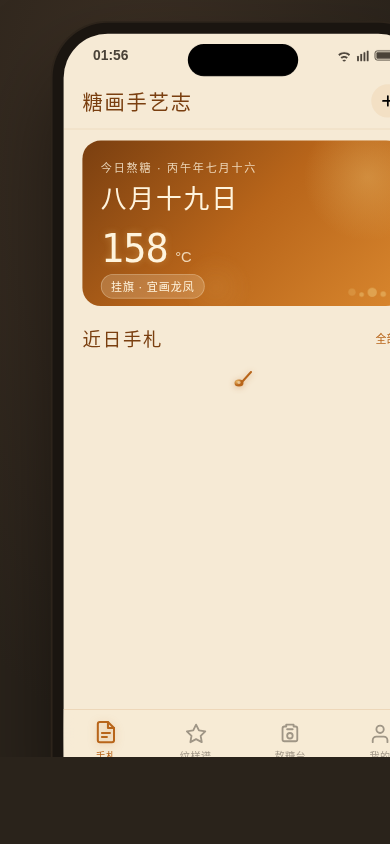

# 糖画手艺志 · V2 手机 UI

形态：原生 App

**日期**：2026-08-19
**方向**：V2 手机 UI
**形态**：原生 App
**主题**：糖画手艺志 — 糖画手艺人的创作日记 App

## 简介

糖画手艺人的创作日记App。核心流程：选图案→调火候→记录成品→积累个人手艺图谱。火候滑块是签名交互——拖动时糖色预览实时从浅金渐变到深琥珀到焦糖色，超过阈值显示"焦了"警告，像真正在铜锅前掌控火候。

## 截图展示

## 动效亮点

- 签名动效：起笔回放（铜勺落下→糖滴→拉丝路径）
- 火候滑块拖动→糖色实时渐变预览
- 糖液气泡浮动 + 铜锅冒泡 + 温度脉冲
- 糖结晶闪烁 + 光泽流动 + 火花飞溅
- 点击糖爆晶花 + 糖液飞溅扩散
- Tab 弹跳切换 + 列表/网格入场
- 自定义光标（糖丝轨迹形态）

## 页面结构（7 页）

| 页面 | 布局 |
|------|------|
| 手札首页（Tab1） | 今日作品列表 + 快速新建按钮 |
| 纹样谱 | 图案选择网格（龙/凤/蝴蝶/兔子/寿桃/金鱼…） |
| 熬糖台 | 火候滑块 + 实时糖色预览 + 备注 |
| 日记详情 | 单条记录查看 |
| 我的（Tab4） | 手艺统计（总作品数/最常用图案/火候偏好） |
| 设计规范 | 设计系统文档 |
| 接口文档 | API 契约说明 |

## 妙搭预览链接

https://dcniaqwtmoca.feishu.cn/page/Du53mw9GCdAm5ra2Tslc1D6Inpe

## 文件说明

| 文件 | 说明 |
|------|------|
| index.html | 完整源码（纯 vanilla 单文件，390px） |
| 设计规范.md | 设计规范文档（含形态标记） |
| preview.png | 390×844 手机端截图 |
| thumbnail.png | 妙搭自动生成缩略图 |

## 技术栈

- 纯 HTML/CSS/JS（vanilla，无 React/Babel/CDN）
- CSS keyframes + JS 交互
- 390px 宽度原生 App 形态（底部 TabBar、页面 push/pop）
- 支持 prefers-reduced-motion
- 自定义光标系统
