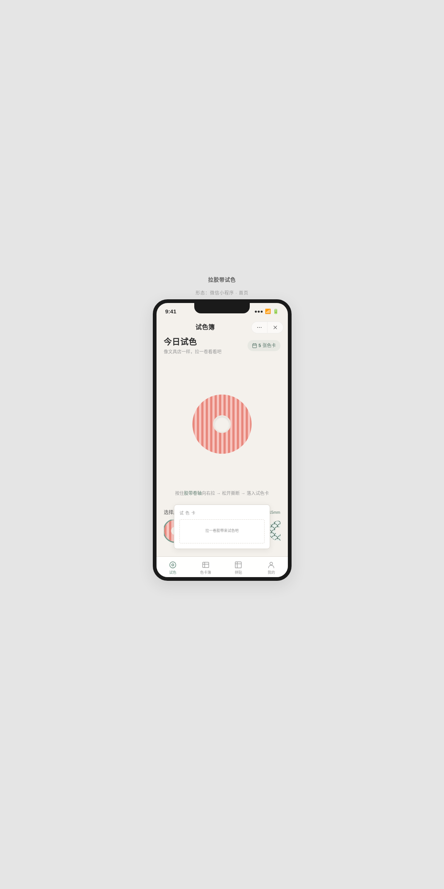

形态：微信小程序

# 纸胶带试色簿 · Washi Tape Swatch Book

> 一个纸胶带收藏试色手账微信小程序——从卷轴拉出胶带、撕断落卡、标记色系、归入色卡簿、拼贴手账预览。

## 简介

纸胶带（washi tape）收藏是东亚文具爱好者的高频日常。这款微信小程序将"试色"这一核心行为数字化：用户像在文具店拉出一卷胶带试色，按住卷轴拖拽拉出胶带条，释放时胶带撕断（纤维毛边飞散），胶带条落入试色卡，半屏弹层选择色系后存入色卡簿。色卡簿可按 8 色系筛选浏览，选中胶带可加入拼贴手账预览页排布组合。

## 截图

## 妙搭预览

https://dcniaqwtmoca.feishu.cn/page/JStrmESnCdORYdaeECZcZJcAnkh

## 文件说明

| 文件 | 说明 |
|------|------|
| `index.html` | 单文件 vanilla HTML（~84KB），含全部 CSS/JS/数据 |
| `设计规范.md` | 色彩/字体/间距/动效/端侧交互完整规范 |
| `preview.png` | chromium 无头截图（1200×2400） |
| `README.md` | 本文件 |

## 页面结构

| Tab | 页面 | 核心功能 |
|-----|------|----------|
| 试色 | 胶带拉拽工作台 | 12 款胶带选择 + 拉出撕断签名交互 + 落卡 + 半屏弹层选色系 |
| 色卡簿 | 试色卡网格 | 按 8 色系筛选 + 左滑删除 + 点击查看详情 |
| 拼贴 | 手账拼贴预览 | 选胶带排布到空白手账页 + localStorage 持久化 |
| 我的 | 统计/设置 | 收藏数/胶带数统计 + 设计规范/接口文档入口 |

二级页面（页面栈 push/pop）：设计规范页、接口文档页。

## 签名交互

**胶带拉出 → 撕断 → 落卡**：按住卷轴拖拽，胶带条随手指延伸、卷轴同步旋转放卷；释放时若拉出 ≥40px 则触发撕断——纤维毛边显现、8 个粒子飞散、胶带条弹性落入试色卡、半屏弹层滑出色系选择器。拉出不足 40px 则弹性回弹收回。

## 微信小程序端侧交互（7 种）

1. 胶囊按钮（右上角关闭/更多）
2. 自定义导航栏（返回+标题）
3. 底部 TabBar（4 标签：试色/色卡簿/拼贴/我的）
4. 半屏弹层（色系选择/卡片详情）
5. 下拉刷新（试色页+色卡簿页）
6. 左滑操作（色卡簿卡片左滑删除）
7. 页面栈 push/pop（设计规范/接口文档二级页）

## 胶带数据

12 款真实纸胶带，覆盖 6 种图案类型（条纹/波点/和风青海波/花卉/几何/格纹/大理石/纯色）、8 色系（红/橙/黄/绿/蓝/紫/棕/灰白）、4 种宽度规格（6mm/10mm/15mm/20mm）、6 个品牌（和风文创/青釉社/甜梦手账/云间纸品/花间集/几何实验室/英伦书房/素品）。

## 技术栈

- 纯 vanilla 单文件 HTML（无 React/Babel/CDN）
- 内联 CSS + JS，零外部依赖
- CSS 渐变/重复背景实现 12 款胶带图案（无图片）
- localStorage 持久化（试色卡册 + 拼贴方案）
- 支持 `prefers-reduced-motion`
- `visibilitychange` 暂停交互状态
- 375px 微信小程序视觉约定

## 配色

瓷白 `#F4F1EC` + 鼠尾草绿 `#7A9B8E` + 多色胶带试色。禁蓝紫渐变。
