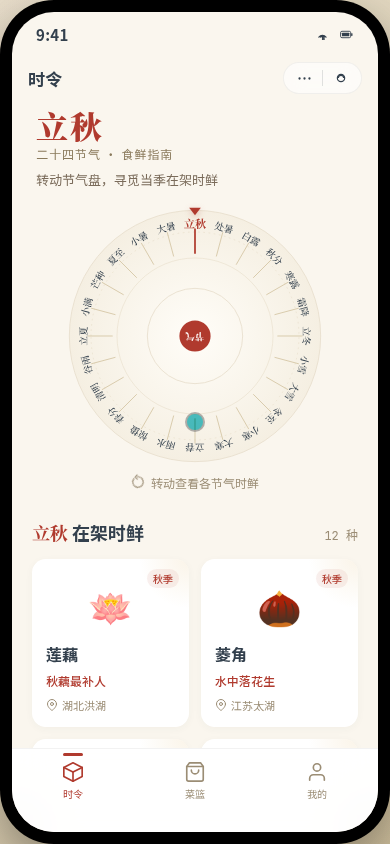

# 节气菜篮 · 时令食鲜小程序 V2

形态：微信小程序

## 项目简介
「节气菜篮」是 Art 设计实验室 V2 手机 UI 作品，形态为微信小程序。首页是一只可拖拽旋转的二十四节气盘，当下节气（立秋）置顶高亮；转动选节气 → 在架时鲜潮水刷新 → 点食材出半屏弹层（挑选/储存/可食性/做法）→ 看家常做法 → 加入菜篮 → 菜篮清单可勾选/增减/左滑删除（localStorage 持久化）。把"什么时候吃什么"变成可转动的时令。

## 截图

## 妙搭预览
https://dcniaqwtmoca.feishu.cn/page/QK5XmTlJ8dcnAmafaEucuVbzn8d

## 文件说明
- `index.html` — 页面结构（24K）
- `app.js` — 交互逻辑（节气转盘、弹层、菜篮、Tab、localStorage）
- `data.js` — 二十四节气与 ≥12 种时令食材数据
- `styles.css` — 样式（27K）
- `设计规范.md` — 色值、字体、动效系统、接口文档
- `preview.png` — 时令页截图

## 小程序端侧语言（6 种）
自定义导航栏 + 右上角胶囊按钮、页面栈 push/pop（返回箭头）、底部 TabBar（3 Tab）、半屏弹层、吸底操作栏、下拉弹性回弹、左滑删除。

## 技术栈
单文件 HTML + JS + CSS，纯前端 localStorage 持久化，无后端。定时器/RAF 随可见性暂停且卸载取消；支持 prefers-reduced-motion；390px/430px 适配；Console 零 Error。

## 设计要点
- 首页反模板：节气转盘而非问候+搜索+Banner
- 核心流程可走通：转盘 → 食材详情 → 做法 → 菜篮（实测 localStorage 持久 `jieqi_cailan_basket_v2`）
- 配色：米白底 × 茜红主色 × 秋香黄点缀 × 黛青灰文字（明快菜市场海报风，非蓝紫渐变）
- 12+ 组件级动效，转盘惯性吸附 + 弹层弹簧 + Tab 横滑 + 勾选/左滑反馈
- 自定义指尖光标开页居中

## 自查结论
Browser QA（390/430/1440）：零 Console Error、零 pageerror、零失败资源、零横向溢出，截图非空白。核心流程实测通过：点击 `.ingredient-card` 弹出详情 → 点击「加入菜篮」→ localStorage 写入 `莲藕 qty1` → 切到菜篮 Tab 可见条目。无假功能。
