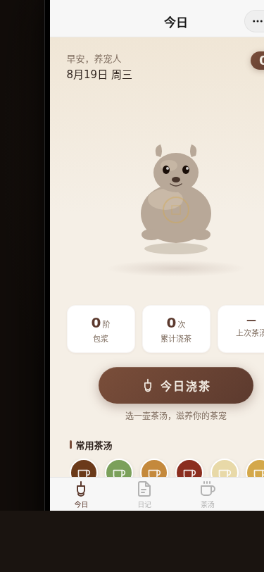

# 茶宠志

形态：微信小程序

## 主题

茶宠养成小程序——每日浇茶，包浆渐变，记录茶宠成长日记。

## 简介

一个完整多页面的微信小程序端侧 mock。核心产品逻辑是「养茶宠」：用户在「今日」页选择茶种（龙井/碧螺春/霍山黄芽/正山小种/普洱/白茶六种），点击浇茶按钮，茶壶倾倒、茶流落下、茶宠被茶汤浸润，包浆值（patinaLevel）随之增长。包浆分 5 级（素坯→浅润→蜜润→温润→深沉），茶宠的 SVG 颜色随等级渐变。累计浇茶到阈值后解锁成长日记条目。

4 个底部 Tab（今日/日记/茶/我的）+ 设计规范页 + 接口文档页。使用微信小程序端侧交互语言：胶囊按钮+自定义导航栏、底部 TabBar、半屏弹层、页面栈 push/pop、下拉刷新弹性。localStorage 持久化所有用户数据。

## 截图

## 妙搭预览

https://dcniaqwtmoca.feishu.cn/page/X5p2mFt6od1KeLaiuUBcNI27nWc

## 文件说明

| 文件 | 说明 |
|------|------|
| index.html | 完整源码（HTML+CSS+JS 单文件） |
| 设计规范.md | 色彩/字体/动效/布局/端侧交互规范 |
| preview.png | 375×812 手机截图 |

## 技术栈

纯 vanilla 单文件（HTML+CSS+JS），模拟微信小程序端侧布局与交互。localStorage 持久化。162 处 SVG 路径构建茶宠/茶壶/茶具图形。8 组 keyframe 动画（splash/stream/steam/pet/pot/wisp/pulse/badge）。

## 配色

茶金+深棕+奶白+朱砂红的茶汤陶土色调，不使用蓝紫渐变。
