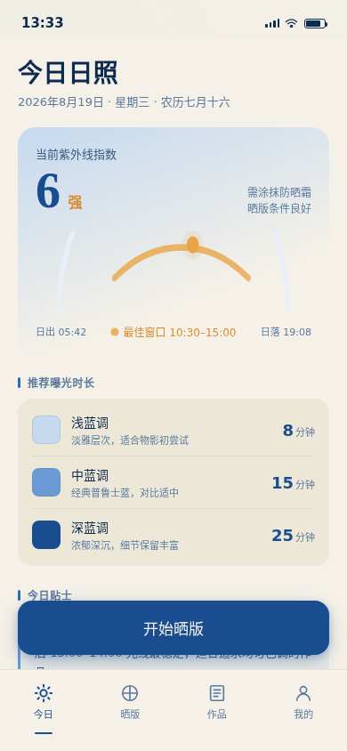
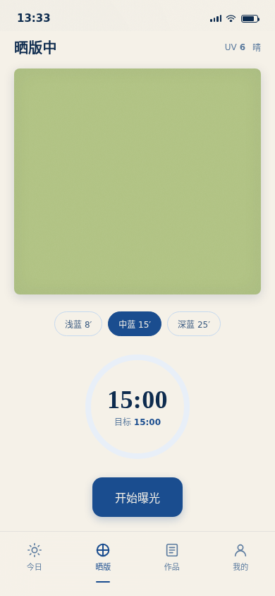
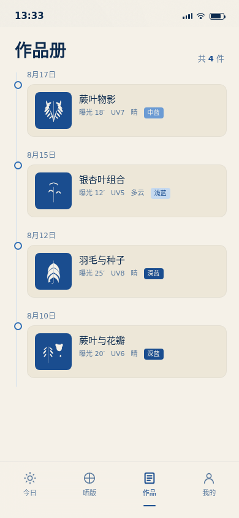
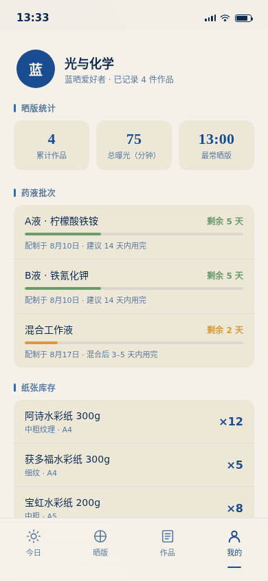

# 蓝晒手帖 · V2 手机 UI

形态：原生 App

## 简介

蓝晒手帖（Cyanotype Journal）是一款面向蓝晒手工爱好者的原生 App。蓝晒是古典摄影工艺——将感光溶液涂在纸上、用紫外线曝光、水洗显影，最终生成普鲁士蓝影像。App 解决三个核心痛点：今天的光够不够晒？晒多久？上次什么参数出了什么效果？

核心用户流程：打开 App → 查看今日紫外线与日照窗口 → 开始晒版计时 → 纸面逐渐变深 → 拖入水中冲洗显影 → 记录入册 → 翻阅历史作品对比参数。

## 截图

### 今日页（首页）

### 晒版页

### 作品页

### 我的页

## 妙搭预览

[蓝晒手帖 · 在线预览](https://dcniaqwtmoca.feishu.cn/page/TpVzmPc6wdfDlBabhoJcfo0fn4b)

## 文件说明

| 文件 | 说明 |
|------|------|
| `index.html` | 完整应用源码（纯 vanilla 单文件，79.5KB） |
| `preview.png` | 首页截图 |
| `tab2_expose.png` | 晒版页截图 |
| `tab3_prints.png` | 作品页截图 |
| `tab4_profile.png` | 我的页截图 |
| `设计规范.md` | 色彩/字体/材质/动效系统规范 |
| `thumbnail.png` | 妙搭平台自动生成的缩略图 |

## 技术栈

- 纯 HTML + CSS + Vanilla JavaScript，单文件无构建
- 零外部依赖（无 CDN、无外部字体、无外部图片）
- CSS 变量主题化，内联 SVG 噪点滤镜模拟纸纤维
- 支持 `prefers-reduced-motion` 全量降级
- `visibilitychange` 暂停/恢复所有 RAF 与定时器
- `beforeunload` 清理资源

## 设计要点

- **色彩**：普鲁士蓝家族（#1A4D8F → #C5D9EF）+ 水彩纸暖白（#F5F1E8）+ 药液黄绿（#B5C68A）+ 日光琥珀（#E8A547）。蓝色来自工艺本身，不是科技蓝紫
- **字体**：Georgia/宋体衬线（标题/数字）+ system-ui 无衬线（正文）
- **签名动效**：冲洗显影——纸面浸入水中，黄绿未曝光化学物溶解，普鲁士蓝从灰绿中浮现，水面涟漪扩散，3 秒完成
- **材质**：水彩纸纤维纹理（CSS+SVG noise）、药液涂刷不规则边缘、墨蓝色调阴影
- **首页**：日照情报站（太阳弧线+紫外线指数+最佳窗口），非通用问候+搜索+Banner模板

## 创作信息

- 日期：2026-08-19
- 类别：V2 手机 UI
- 形态：原生 App（4 Tab 底部导航 + 页面栈 push/pop）
- 妙搭 app_id：app_17cdu6fm3we
