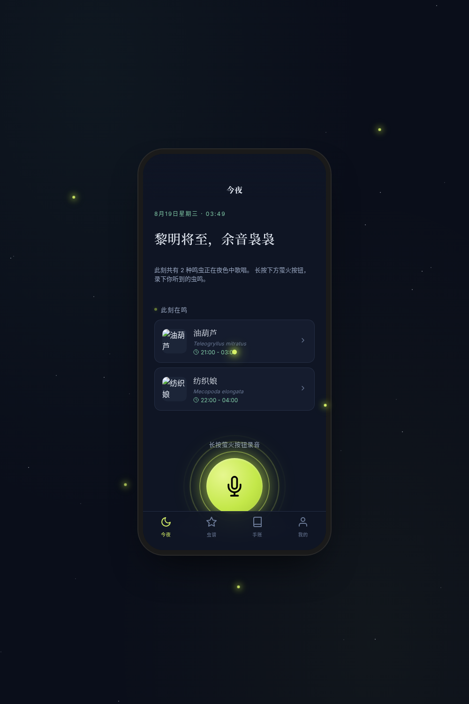

形态：原生 App

# 虫鸣 · 夏夜听虫

**类别**：Phone Mock　**日期**：2026-08-19　**形态**：原生 App

## 简介
夏夜听虫的夜行伴侣。夜里听到虫叫，打开 App 首屏即「今夜」——此刻正在鸣叫的虫与大录音按钮；长按萤火按钮录音，声波化作流萤收束点亮识别结果；确认后收入个人虫谱，沉淀为夜晚手账。完整闭环：今夜 → 长按录音 → 声纹识别 → 加入虫谱 → 夜晚手账。

## 主题
夏夜鸣虫识别与记录（蟋蟀/油葫芦/蝈蝈/纺织娘/金钟儿/竹蛉）

## 截图

## 妙搭预览
https://dcniaqwtmoca.feishu.cn/page/E9mBmkYqVdYnMIazsVXcOW77nlJ

## 文件说明
- `index.html` — 入口（加载 React/Babel，挂载 root）
- `styles.css` — 全局样式与夜幕主题
- `components/` — 各页面组件（今夜/录音/结果弹层/虫谱/手账/我的/详情/设计规范/接口文档/萤火光标/共享/外壳）
- `data/insects.jsx` — 6 种鸣虫真实数据
- `state/store.jsx` — 状态与 localStorage 持久化
- `preview.png` — 浏览器无头渲染截图
- `设计规范.md` — 色彩/字体/动效系统

## 技术栈
React 18 + Babel（JSX 内联），390px 设备容器；自定义萤火光标；支持 prefers-reduced-motion；RAF 随可见性暂停。

## 设计要点
- 首屏=今夜状态（当前时段鸣虫 + 大录音按钮），非通用首页模板
- 端侧语言 ≥6 种：状态栏/安全区、底部 TabBar、页面栈、底部弹层、长按手势、深色模式
- 签名动效：录音声波化作流萤四散并收束点亮虫名
