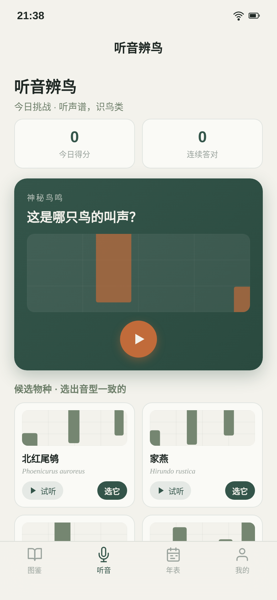

# 羽志·观鸟年表（原生 App）

形态：原生 App

> 日期：2026-08-19 · 方向：V2 手机 UI · 形态：原生 App · 主题：随身观鸟图鉴 + 听音辨鸟声谱挑战

## 简介

「羽志」是一本能发声的随身博物图鉴。翻开是手绘羽翼线稿，记录今天看到的一只鸟，点亮图鉴、攒进观鸟年表；每天还有一段「听音辨鸟」声谱挑战——神秘鸟鸣以钢琴卷帘声谱流动播放并真实发声，从四个候选声谱里听出是谁。

设计语言来自博物志手绘鸟类图鉴与田野笔记（冷雾米白 + 石青苔绿 + 赭橙鸟羽 + 候鸟迁徙红），刻意避开近期手作类的暖纸朱砂木器陶土气质。签名交互用 WebAudio 真实合成鸟鸣音型 + 声谱可视化，取代已饱和的「印章/拖拽」签名族。

## 核心产品逻辑

- **图鉴**：14 种真实中国常见鸟（麻雀、白头鹎、珠颈斑鸠、喜鹊、家燕、白鹭、夜鹭、红嘴蓝鹊、戴胜、棕背伯劳、黑水鸡、小䴙䴘、北红尾鸲、白鹡鸰），含中文名 / 拉丁文学名 / 类群 / 居留型 / 体长 / 识别要点 / 居留季节说明。按类群、居留型双维筛选真实过滤。
- **目击记录闭环**：物种页 → 记录目击（地点/日期/数量 stepper/备注）→ 图鉴卡从未见点亮为已见（墨点扩散）→ 年表统计真实更新 → localStorage 持久化刷新保留。
- **听音辨鸟**（签名）：WebAudio 合成每只鸟独立音型，神秘鸟鸣声谱流动播放 + 4 候选声谱缩略可试听，选对点亮 + 得分 + 连击。
- **年表**：年度物种数 / 目击次数 / 最近目击时间线 / 当季候鸟迁徙提醒（夏候南迁、旅鸟过境、冬候先头、留鸟繁殖后期，内容真实可信）。
- **我的**：昵称、累计物种 / 目击 / 连续打卡、深色与动效开关（动效开关真实有效）、清除数据。

## 截图

主预览（图鉴首屏）：


更多页面状态：




## 妙搭预览链接

https://dcniaqwtmoca.feishu.cn/page/Qnx4mc68FdPIHQaMQMdcjG2inZe

## 文件说明

```
2026-08-19_观鸟年表_birding-lifelist/
├── index.html          纯 vanilla 单文件应用（93KB，自包含）
├── 设计规范.md          配色/字体/动效/交互系统（从源码提取真实值）
├── preview.png          主预览截图（图鉴首屏）
├── preview/
│   ├── preview.png           图鉴首屏
│   ├── preview_tab2.png      听音辨鸟
│   ├── preview_detail.png    物种详情
│   ├── preview_chronicle.png 年表
│   └── preview_listen.png    听音候选
└── README.md           本文件（含形态标记行）
```

## 技术栈

纯 HTML/CSS/JS 单文件 · Web Audio API（OscillatorNode + GainNode 合成鸟鸣）· requestAnimationFrame 声谱流动 · localStorage 持久化 · inline SVG 鸟类线稿 · 无 React/Babel/CDN/外部字体图片。

## 设计自查

- 删掉所有动画，设计仍成立（图鉴网格/详情/年表静态可读）。
- 灰度下信息层级仍成立（靠尺寸 + 衬线/无衬线 + 留白建立层级，不依赖颜色）。
- 轮廓与近期手作收藏类不雷同（life list 网格 + 声谱挑战，非印章/戥秤/漆扇结构）。
- 签名交互（听音辨鸟 WebAudio 声谱）与近期拖拽/印章签名族正交。
