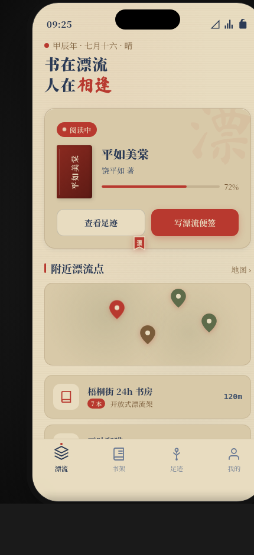

# 邻里图书漂流

> Art 设计实验室 · V2 手机 UI · 2026-08-19

形态：原生 App

## 主题
社区图书漂流 App——以"一本书的漂流足迹"为主轴的邻里图书漂流产品。

## 简介
原生 App（非微信小程序），4 Tab（漂流/书架/足迹/我的）。首页非通用模板，核心是手里这本书的当前状态卡 + 附近漂流点。核心闭环可走通：扫码收书 → 写漂流便签 → 放漂给下一位/投放漂流点 → 查看足迹。足迹 Tab 是签名记忆点：朱砂漂流印章节点串成麻绳时间线，每位读者一段便签，滚动依次盖章。

## 截图

## 妙搭预览链接
https://dcniaqwtmoca.feishu.cn/page/EotumoT6ddvFTDai1dLcyFcynMb

## 文件说明
- `index.html` — 单文件应用（vanilla，390×844 手机屏）
- `设计规范.md` — 产品定义 / 信息架构 / 配色 / 动效 / User Flow
- `preview.png` — 浏览器渲染截图（430×940）
- `thumbnail.png` — 妙搭平台缩略图
- `components/` — 妙搭脚手架组件目录

## 技术栈
纯 vanilla 单 HTML 文件，无 React/Babel/CDN。requestAnimationFrame + transition 驱动，visibilitychange 暂停，prefers-reduced-motion 降级。

## 自检结论
- 去颜色/品牌名仍能凭交互结构判断是"图书漂流"产品
- 首页非通用问候语+搜索+Banner 模板
- 完整收-读-签-放-看足迹闭环可走通，状态真实变化
- 无假功能（按钮均有真实状态变化）
- Browser QA：0 Console Error / 0 资源失败 / 截图非空白
