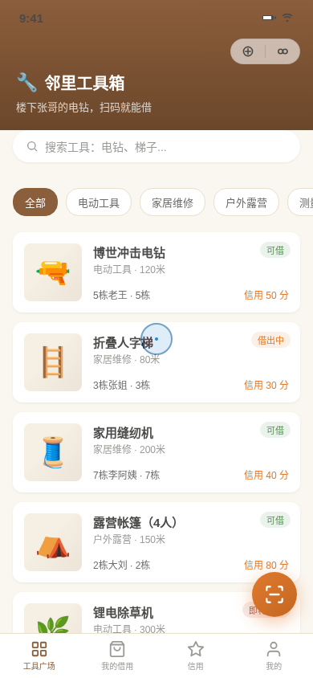

形态：微信小程序

# 邻里工具箱 · 微信小程序 V2

社区共享工具借用微信小程序。把"邻居家吃灰的电钻"变成扫码即借的邻里资源网。

> 妙搭预览：https://dcniaqwtmoca.feishu.cn/page/OI9WmKwmUd33KTastlvcgPknnhh



## 产品机制

居民扫码借用邻居共享的工具，到期自动提醒，归还确认，信用积分在借用/归还间流动。

## 完整 User Flow

首页工具列表 → 点工具（或扫码）→ 半屏详情 → 「申请借用」吸底确认（信用预扣）→ 我的借用（到期倒计时/提醒）→ 归还确认（信用返还）

## 页面清单

| 页面 | 说明 |
|------|------|
| 工具广场（首页） | 下拉刷新，真实工具列表，分类筛选，搜索栏 |
| 工具半屏详情 | 工具说明、出借人信息、借用规则，吸底确认栏 |
| 我的借用 | 借用记录、到期倒计时、左滑归还、空状态 |
| 信用页 | 信用分数字滚动、信用记录、增减规则 |
| 我的页 | 用户信息卡片、菜单列表、入口 |
| 设计规范页 | 色彩、字体、组件、动效规范 |
| 接口文档页 | 工具/借用/信用模块接口 |

## 端侧交互（6 种）

1. **胶囊按钮 + 自定义导航栏** — 微信小程序标志性 UI
2. **底部 TabBar** — 工具广场 / 我的借用 / 信用 / 我的
3. **半屏弹层 Bottom Sheet** — 工具详情 + 吸底操作栏
4. **下拉刷新弹性** — 首页下拉触发刷新动画
5. **左滑操作** — 我的借用列表左滑露出「确认归还」
6. **吸底操作栏** — 确认借用按钮 + 信用预扣显示

## 签名记忆点

扫码借用——相机扫码框 → 识别工具 → 半屏详情 → 吸底确认 → 信用分预扣动画 → 到期倒计时卡生成

## 状态设计

- 工具状态：可借 / 借出中 / 即将归还
- 借用状态：借用中 / 即将到期 / 已归还
- 空状态：无借用记录时的引导页
- 操作反馈：Toast 提示、信用分浮动动效、数字滚动

## 配色方案

| 颜色 | 色值 | 用途 |
|------|------|------|
| 木质暖棕 | `#8B5E3C` | 主色、导航栏、强调 |
| 安全橙 | `#E07A2F` | 行动按钮、信用分、提醒 |
| 亚麻米白 | `#F5EFE4` | 背景、卡片底色 |
| 钢灰 | `#4A4A48` | 文字、主色文字 |

## 技术实现

- 纯 vanilla JS 单文件（无 React/Babel/CDN）
- CSS 原生变量 + Flex/Grid 布局
- 所有路径为相对路径
- 支持 prefers-reduced-motion
- RAF 随页面可见性暂停
- 响应式：手机外壳 + 小屏全屏适配

## 文件结构

```
.
├── index.html          # 主入口
├── css/
│   └── styles.css      # 全部样式
├── js/
│   └── app.js          # 全部交互逻辑
├── README.md           # 本文件
└── 设计规范.md         # 设计规范说明
```

## 本地运行

直接用浏览器打开 `index.html` 即可，无需构建步骤。

## V2 说明

本版本为 V2，配色为工具间木质暖棕系，与 V1、V3 互不雷同。
