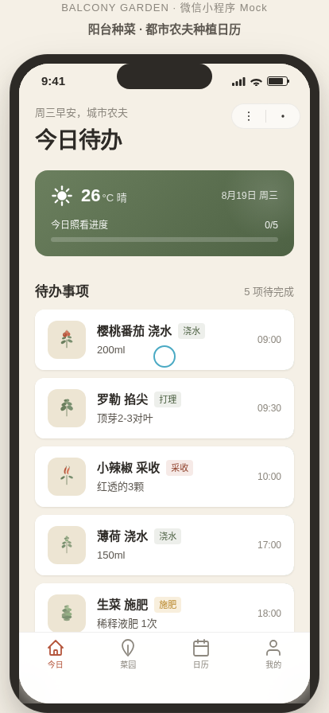

# 阳台种菜 · 都市农夫种植日历

形态：微信小程序

> 日期：2026-08-19　|　类别：Phone Mock　|　Art Orchestrator batch14

## 简介
一个阳台种菜日常管理微信小程序：今日待办（浇水/施肥/采收）、作物档案、生长记录（拍照+笔记）、种植日历提醒。完整 user flow：打开→今日待办→作物详情→记录生长→生长时间轴→日历提醒。每天打开花两分钟照看阳台作物，有"养着养着就长大了"的陪伴感。

## 设计观点
不套用"问候+搜索+banner+分类icon+推荐+底部nav"的通用 App 首页模板。以"今日待办"为首屏核心，签名动效=拖动浇水壶浇水（连续输入+水滴+进度+作物舒展），服务产品而非炫技。

## 形态交替
- 上一次（浪候 swelllog-surf）：原生 App
- 本次：微信小程序
- 下一次：原生 App

## 截图

## 妙搭预览
https://dcniaqwtmoca.feishu.cn/page/M44mmQLQ8dWo3fa6xxKcneZOnUg

## 文件说明
- `index.html` — 单文件纯 vanilla 实现（390×844 手机容器，内联 SVG，无外部依赖）
- `preview.png` — 414×896 截图（今日页）
- `设计规范.md` — 色值/字体/动效/小程序端侧交互

## 技术栈
纯 HTML + CSS + Vanilla JS，内联 SVG，requestAnimationFrame，prefers-reduced-motion 全降级。无 React/Babel/CDN/外部图片。

## 小程序端侧交互（≥4 种真实可用）
胶囊按钮+自定义导航栏、页面栈 push/pop、底部 TabBar、半屏 ActionSheet、下拉刷新弹性、左滑操作、吸底操作栏。

## 核心交互
- 拖动浇水壶浇水（签名动效）
- 左滑作物标记完成
- 记录生长半屏表单 → 时间轴插入
- 日历点日期看提醒

## 自查
- [x] 完整 user flow 可走通（今日→详情→记录→时间轴→日历）
- [x] 小程序端侧交互≥4 种真实工作
- [x] 非网页缩进手机、非通用首页模板
- [x] Browser QA：无 console error，截图非空白（pixelStd 68.85）
- [x] 内容真实，无假功能
- [x] 形态标记：微信小程序
