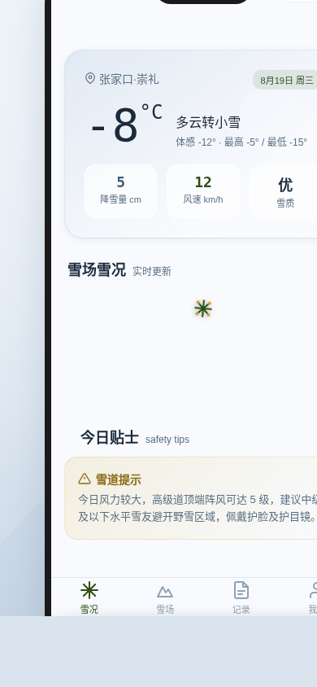

形态：微信小程序

# 雪线 · 滑雪图鉴 Snowline Ski Atlas

> 方向：V2 手机 UI · 形态：微信小程序 · 日期：2026-08-19 · 主题：高山滑雪场图鉴 + 滑行日志

## 简介

「雪线」是一个面向滑雪爱好者的微信小程序，集雪场图鉴、雪况查询、滑行日志于一体。打开即可看到今日天气和各雪场实时雪况，浏览 6 座真实中国滑雪场（万龙、云顶、松花湖、北大壶、亚布力、可可托海），在滑道图上切换初级/中级/高级道图层，记录每次滑雪日志并积累赛季统计。

底部 TabBar 四标签（雪况 / 雪场 / 记录 / 我的）覆盖完整用户流程：查雪况 → 选雪场 → 看滑道 → 记日志 → 看统计。所有功能均可真实操作，日志保存到 localStorage。

## 截图展示

## 妙搭预览链接

https://dcniaqwtmoca.feishu.cn/page/Tr1PmXWdgdEwzGaZQDvcqaAtnqc

## 文件说明

| 文件 | 说明 |
|------|------|
| index.html | 完整源码（纯 vanilla 单文件，104KB） |
| preview.png | 浏览器截图（390×844） |
| 设计规范.md | 设计系统文档（色值/字体/动效/产品流程） |

## 技术栈

- 纯 HTML + CSS + JavaScript，无 React / Babel / CDN 依赖
- localStorage 数据持久化（滑行日志）
- requestAnimationFrame 动画
- 支持 prefers-reduced-motion
- 微信小程序 UI 框架（胶囊按钮 + 自定义导航栏 + 底部 TabBar + 半屏弹层）

## 设计要点

- **形态**：微信小程序（上次 V2 为原生 App，本次交替为微信小程序）
- **配色**：雪山冬季四色（雪白 + 冰蓝灰 + 松绿 + 暖琥珀），禁蓝紫渐变
- **产品逻辑**：发现雪场 → 了解雪况 → 规划出行 → 记录体验 → 回顾赛季
- **真实数据**：6 座中国滑雪场，含雪道数/海拔/落差/开放状态
- **滑道图**：SVG 山体俯视图，初级（绿）/中级（蓝）/高级（黑）三层可切换
- **全部功能可用**：搜索筛选、收藏、日志记录、导出摘要——无假功能
