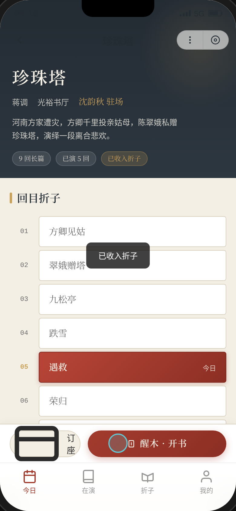
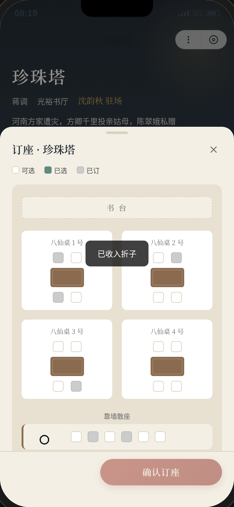
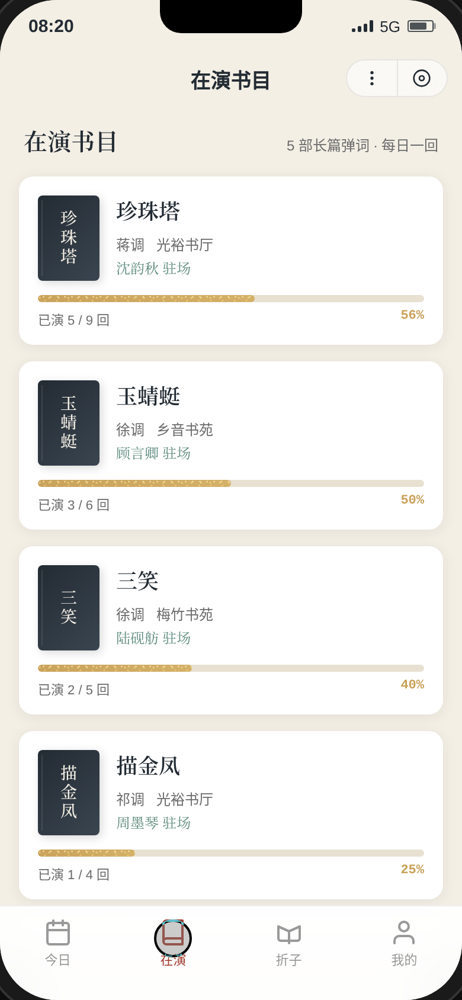
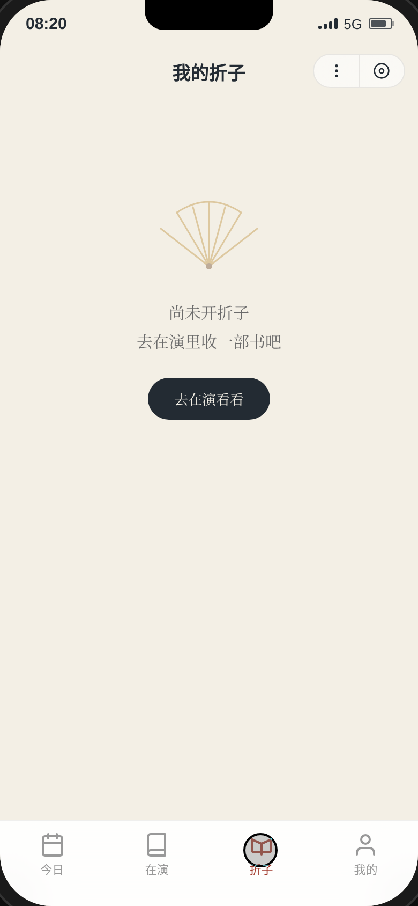
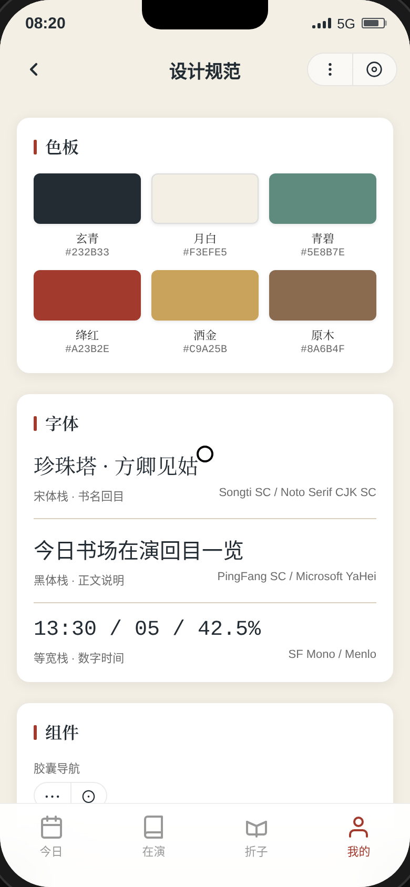
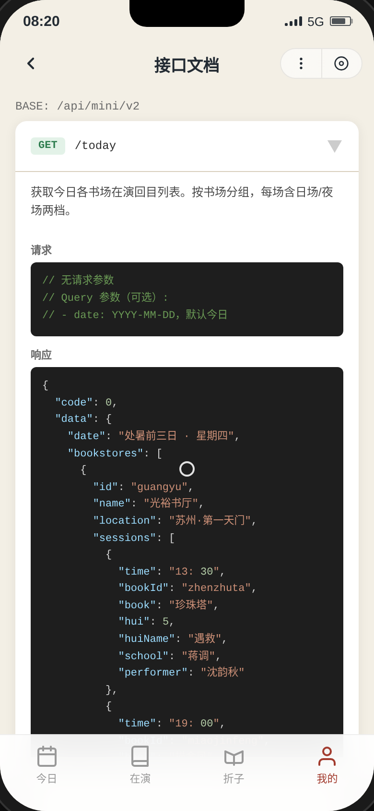

# 一席书场 · 评弹书场微信小程序 UI

形态：微信小程序

## 简介

「一席书场」是一款模拟苏州评弹书场微信小程序的 UI Mock。以评弹书场的物理空间为设计母题——玄青梁柱、月白窗棂、绛红长衫、洒金折扇——构建一个「听书人」视角的微信小程序，涵盖今日在演、书目详情、在线订座、醒木开书（签到追书）、我的折子（收藏管理）、设计规范与接口文档等完整用户流程。

签名动效为「醒木开书」：点击醒木按钮后震屏→折扇展开显示当前回目→签条翻转进度+1→按钮变灰锁定，每日每部书限开一次。

## 截图展示

| 今日在演 | 书目详情 | 收入折子后 | 选座面板 |
|----------|----------|------------|----------|
|  |  |  |  |

| 在演书目 | 我的折子 | 设计规范 | 接口文档 |
|----------|----------|----------|----------|
|  |  |  |  |

## 妙搭预览链接

https://dcniaqwtmoca.feishu.cn/page/ENo0mrZZEdjqDra4uRUcGkSrnFg

## 文件说明

| 文件 | 说明 |
|------|------|
| `index.html` | 完整单文件 HTML 源码（纯 vanilla JS，无外部依赖） |
| `preview.png` | 今日在演页截图（390×844 @2x） |
| `shot_02_detail.png` | 书目详情页截图 |
| `shot_03_collected.png` | 收入折子后截图 |
| `shot_04_seat.png` | 选座半屏弹层截图 |
| `shot_05_performing.png` | 在演书目页截图 |
| `shot_06_zhezi.png` | 我的折子页截图 |
| `shot_07_profile.png` | 个人中心页截图 |
| `shot_08_spec.png` | 设计规范页截图 |
| `shot_09_api.png` | 接口文档页截图 |
| `设计规范.md` | 设计规范文档（色值、字体、动效系统） |

## 技术栈

- 纯 vanilla HTML/CSS/JS 单文件实现（无 React、无 Babel、无外部 CDN）
- CSS 变量主题化（6 色色彩系统 + 3 字体栈）
- localStorage 持久化（key: `yixi_shuchang_v2`）
- 支持 `prefers-reduced-motion`
- RAF/定时器随页面可见性暂停，卸载时清理

## 微信小程序端侧交互

1. 胶囊按钮 + 自定义导航栏（右上角模拟微信胶囊）
2. 底部 TabBar（4 Tab：今日/在演/折子/我的）
3. 半屏弹层（选座面板从底部滑入）
4. 页面栈 push/pop（详情/规范/API 页面从右侧推入，返回键滑出）
5. 下拉刷新（今日页顶部下拉）
6. 左滑操作（折子页卡片左滑露出删除按钮）
7. 吸底操作栏（选座面板底部固定操作栏）

## 真实内容

- 3 家书场：光裕书厅（苏州·第一天门）、乡音书苑（上海·南京西路）、梅竹书苑（苏州·石路）
- 5 部在演书目：珍珠塔（蒋调·沈韵秋）、描金凤（祁调·周墨琴）、玉蜻蜓（徐调·顾言卿）、白蛇传（俞调·王凌波）、三笑（徐调·陆砚舫）
- 节气日期：以处暑（8月23日）为基准动态计算前后日期
- API 接口路径：`/api/mini/v2/` 前缀，含 /today、/books、/books/{id}/hui、/orders/seat、/checkin/kaishu、/my/zhezi 等端点
