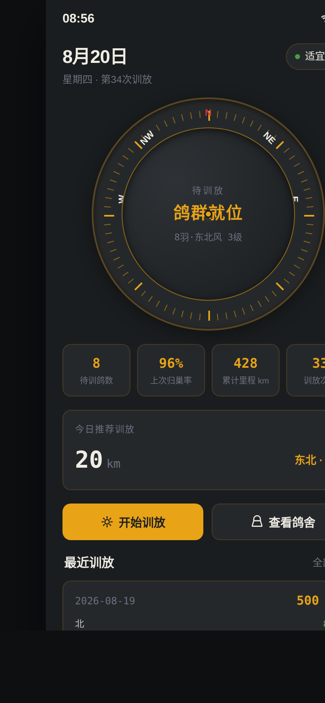

# 信鸽竞翔训练台

**形态：原生 App**

---

## 简介

信鸽竞翔训练台 — 一款为信鸽爱好者设计的原生 App，用于管理鸽群、执行训放、记录归巢、评估训练效果。

设计以「训放罗盘仪」为核心母题，整个界面像飞行员腕表上的方位计时器：碳黑面板、琥珀读数、磷光绿归巢指示、信号红放飞矢量，航空仪表盘视觉语言贯穿全局。

**核心体验闭环**：设定方向 → 释放鸽群 → 等待归巢 → 确认归来 → 评估训练效果。

**签名交互**：放飞时鸽群从罗盘中心扇形扩散消失，归巢时光点从四面八方向中心收敛脉冲。

---

## 截图展示

---

## 妙搭预览链接

在线预览：https://dcniaqwtmoca.feishu.cn/page/DAWRmfj6KdzULha5tZWcra96nld

---

## 文件说明

| 文件 | 说明 |
|------|------|
| `index.html` | 主应用文件（纯 Vanilla 单文件 HTML，7 个完整页面） |
| `设计规范.md` | 完整设计规范（色板/字体/组件/动效/布局） |
| `README.md` | 项目说明文档 |
| `preview.png` | 首页预览截图 |

---

## 技术栈

- **纯 Vanilla HTML/CSS/JS** — 单文件、零框架、零外部依赖
- **CSS 自定义属性** — 设计 Token 化管理
- **Touch + Mouse 双端事件** — 罗盘拖动交互
- **CSS Transform + Transition** — 粒子系统与页面转场
- **localStorage** — 训放档案持久化（带 try-catch 保护）
- **prefers-reduced-motion** — 动效无障碍降级

---

## 页面结构（7 页）

1. **今日训放** — 罗盘仪表盘首页，天气/状态/数据/快捷入口
2. **鸽舍** — 8 只信鸽列表，筛选，详情弹层
3. **训放执行** — 可拖动罗盘选方向 + 距离档位 + 选鸽 + 放飞
4. **归巢记录** — 实时计时器 + 逐只/批量归巢确认 + 收敛动画
5. **训练档案** — 统计面板 + 历史记录列表 + 规范/文档入口
6. **设计规范** — 色板/字体/组件/动效系统说明
7. **接口文档** — 8 个 `/api/pigeon/v2/*` 完整契约假接口

---

## 交互亮点

- **罗盘旋转**：外圈可拖动旋转选方向，松手吸附到最近 45° 方位
- **放飞粒子**：6-12 个粒子从中心沿选定方向扇形扩散，初快后慢渐隐
- **归巢收敛**：光点从屏幕边缘向中心匀速汇聚，到达时脉冲闪烁
- **完整 User Flow**：选向 → 选距 → 选鸽 → 放飞 → 计时 → 归巢 → 归档
- **底部 4 Tab + 页面栈 Push/Pop** — 原生 App 导航形态
