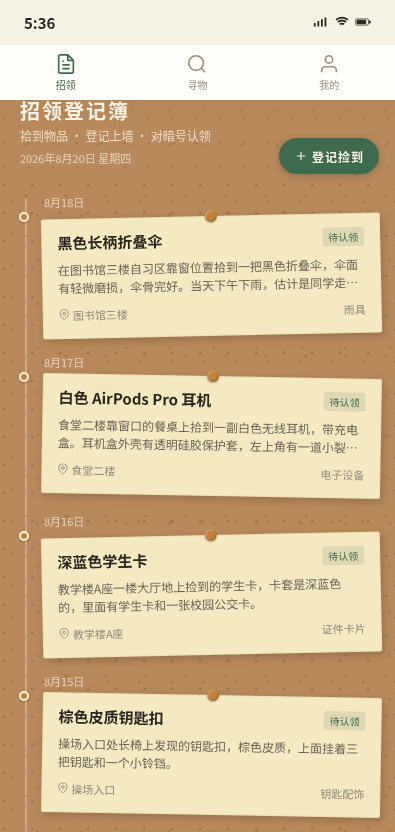

形态：微信小程序

# 招领处 · 失物招领微信小程序

## 主题

社区/校园失物招领微信小程序——把线下失物招领处的登记簿 + 对暗号核验 + 盖章归档流程数字化。

## 简介

「招领处」是一个有温度的失物招领平台。拾到东西的人把物品登记到软木墙便签上，丢东西的人来翻阅登记簿，双方通过**对暗号**（物品独有特征核验）认领，核验通过盖「已归还」墨绿章，物品飞入归还档案。核心机制是「防冒领的对暗号认领」，而非冰冷的一键认领。

## 截图展示

## 妙搭预览链接

在线预览：https://dcniaqwtmoca.feishu.cn/page/WrG9mDx97dYx8OaZqPRchH8Xn1e

本地预览：打开 `index.html` 即可浏览完整交互原型。

## 文件说明

| 文件 | 说明 |
|------|------|
| `index.html` | 主文件，纯 vanilla 单文件实现，含全部页面与交互 |
| `preview.png` | 首页渲染截图 |
| `设计规范.md` | 完整设计规范：色彩、字体、组件、动效、信息架构 |
| `README.md` | 本文件 |

## 技术栈

- **纯 HTML + CSS + 原生 JavaScript**（vanilla，无框架、无外部 CDN 依赖）
- 375 × 812px 手机视口，微信小程序形态
- CSS 变量 + flex/grid 布局
- requestAnimationFrame 驱动飞入动画
- `prefers-reduced-motion` 动效降级

## 功能与交互

### 3 个底部 Tab
1. **招领**：软木墙时间轴便签，按拾获日期倒序排列，下拉刷新
2. **寻物**：智能匹配列表，左滑删除匹配记录
3. **我的**：个人信息 + 找回率统计 + 归还档案入口 + 设置菜单

### 二级页面
- 物品详情页（便签放大 + 拾获信息 + 拾物人 + 认领须知 + 吸底认领按钮）
- 归还档案页（档案墙 + 统计 + 已盖章的归还记录）
- 登记捡到页（上传照片 + 物品信息 + 对暗号特征填写）

### 核心交互：对暗号认领
点击「我要认领」→ 半屏 ActionSheet 升起 → 4 道逐项核验题（颜色/品牌/特殊标记/附带物）→ 答错抖动温和提示重试 → 全对 → 墨绿「已归还」章旋转下压 → 便签带着章飞入归还档案。

### 端侧交互（7 种）
自定义导航栏胶囊、底部 TabBar、页面栈 push/pop、半屏 ActionSheet、下拉刷新弹性、左滑删除、吸底操作栏。

## 色彩系统

软木棕 `#B8895A` / 便签米黄 `#F4E9C1` / 暖白 `#F7F2E6` / 墨绿 `#3E6B4F` / 墨黑 `#2A2620` / 赭 `#C2823A`。零红、零蓝紫渐变。

详见 [设计规范.md](设计规范.md)。

## 签名记忆点

「已归还」墨绿章盖下——核验全过后，印章从上方旋转下压盖在便签上，墨绿印泥晕开感，便签带着章沿弧线飞入「归还档案」墙。不可逆，强确认感。

## 健壮性

- 零未定义引用（IIFE + 严格模式）
- RAF 动画随页面可见性暂停
- 快速操作不叠加定时器（操作态互斥）
- 支持 `prefers-reduced-motion` 降级
- 无外部 CDN 依赖，纯单文件
