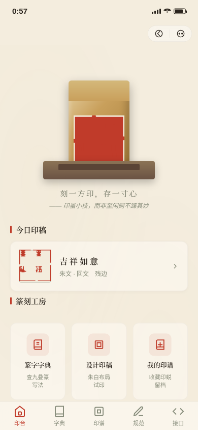

形态：微信小程序

# 方寸印稿 Fangcun Seal · 篆刻印稿设计小程序

> 方向：V2 手机 UI · 形态：微信小程序 · 日期：2026-08-20 · 主题：篆刻印稿设计与钤印工具

## 简介

篆刻爱好者的印稿设计与钤印工具小程序。把「查篆字 → 设计印稿 → 奏刀钤印 → 收入印谱」做成一条完整闭环：打开看到的是印床上一方待刻的石章，不是问候语加搜索框。核心记忆点是**长按钤印**——按压力度（按压时长）直接决定印蜕效果：过轻则印色浅淡缺角，恰到好处则印面饱满带自然飞白，过重则印泥淤积漫漶，每次略有随机差异，鼓励反复比较。

## 妙搭预览

https://dcniaqwtmoca.feishu.cn/page/CiFkm0gxbdG1Hpa5ztgcM1N9nwh

## 页面与核心流程

1. **印台（首页）**：印床上的寿山石章俯视为视觉中心，今日印稿缩略，三入口（篆字字典 / 设计印稿 / 我的印谱）+ 印学小识
2. **篆字字典**：20 个九叠篆字形（吉/印/心/安/山/水/石/书/祥/如/意/福/寿/乐/富/长/风/月/花/人），点字出半屏弹层显示九叠篆大图 + 字义 +「带入印稿」，下拉刷新换一批
3. **印稿设计**：选字（1–4 字，从字典带入）、朱文/白文分段、章法（顺读/回文/横读）、边栏（有边/残边/无边），实时 SVG 印面预览，底部「去钤印」
4. **钤印（签名页）**：宣纸居中展示印稿，吸底「钤印」长按盖章，三档力度反馈 + 随机飞白浓淡；落印后可「再钤一方」或「收入印谱」
5. **我的印谱**：线装书式网格，localStorage 持久化，左滑出现删除、ActionSheet 二次确认，点开看大图 + 创作参数
6. **设计规范**：色板 / 字阶 / 组件 / 动效说明
7. **接口文档**：8 个 `/api/seal/v2/*` 假接口但契约完整（搜索/详情/保存/记录/列表/更新/删除/每日一字）

## 微信小程序端侧交互语言（7 种）

胶囊按钮 + 自定义导航栏、底部 TabBar、页面栈 push/pop、半屏弹层、ActionSheet、左滑操作、吸底操作栏 + 下拉刷新 + 分段控件。

## 截图展示

- 首页·印台工作台（见上方 preview.png）
- 印稿设计页：选字 / 朱白文 / 章法 / 边栏实时预览
- 钤印页：长按 1.5s 落印，反馈「恰到好处，印文饱满」
- 印谱页：线装印存，已存印蜕带释读与日期

## 配色

宣纸米白 `#F4EDDE` 底；朱砂 `#C03B2A` 主色（印泥/主按钮/选中态/印蜕）；墨黑 `#2A241D` 正文；田黄 `#C9A05C` 辅助点缀；石青灰 `#8A8F7E` 次要信息。禁蓝紫渐变，与近期作品（潮间带赶海、手冲咖啡、观云图鉴）配色不雷同。

## 文件说明

- `index.html` — 全部源码（纯 vanilla 单文件，零外部依赖）
- `设计规范.md` — 色彩/字体/动效/组件系统
- `preview.png` — 首页截图

## 技术栈

纯 vanilla HTML/CSS/JS，单文件，无 React / 无 CDN / 无外部字体。localStorage 持久化印谱。支持 `prefers-reduced-motion`（钤印降级为单击直接出印）。

## 设计流水线结论

- Art Director：5 候选，选定「篆刻印稿」（novelty 9 / fit 9 / risk 4），篆刻主题历史未出现
- Designer：按 Design Contract 忠实实现 7 页 + 签名钤印交互
- Browser QA：PASS（0 console error / 0 资源 404 / 无水平溢出 / 6 截图像素 std 全 >5 / 完整流程跑通）
- Critic：Contract Fidelity = FULL，0 CRITICAL，0 MAJOR，1 MINOR（首页头部插画+标语略偏 banner，但视觉中心是印床石章、无模板要素，不构成 MAJOR）
- Quality Gate：CRITICAL=0 → **PASS**

等待协调者检查后提交 GitHub。
