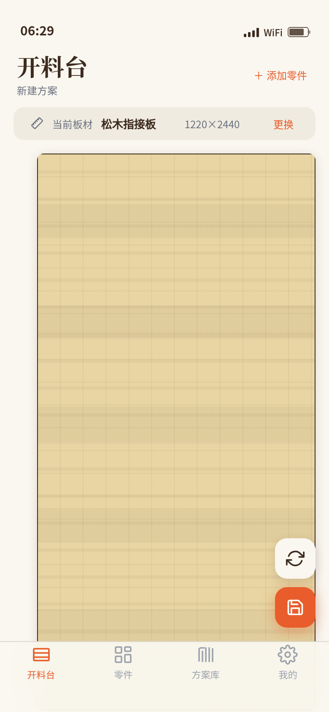

# 木作开料 · 套裁工坊

形态：原生 App

## 主题

木工爱好者的开料套裁工具——输入家具零件清单，选择板材规格，在整板示意上拖拽零件块套裁排版，实时查看利用率与锯路损耗，保存开料图与料单复用。

## 简介

木作开料套裁工坊是一款面向木工爱好者与小型工坊的移动端原生 App。它把专业的板材套裁（nesting）能力装进手机：从零件清单管理，到板材规格选择，再到可视化的拖拽式排版，全程所见即所得。核心交互围绕「一整块板材」展开，用户把零件从下方托盘拖上板面，靠磁性吸附对齐，支持 90° 旋转与木纹方向指示，利用率实时滚动计算，锯缝宽度（4mm）自动留空。方案自动保存在本地，可在方案库中随时载入复用。

## 核心功能

- **开料工作台**：整板可视化画布为首页主对象，非问候语+搜索+Banner 模板
- **拖拽套裁**：指针/触摸均可，磁性吸附板材边缘与相邻零件
- **旋转与木纹**：选中零件可 90° 旋转，木纹方向随旋转更新
- **实时利用率**：零件总面积 / 板材面积，锯缝 4mm 间隔，数字滚动动效
- **木屑溅落**：放下零件时的签名动效，强化材质感
- **零件库管理**：增删零件，真实家具数据（三层小书架等）
- **板材选择**：松木 / 榉木 / 黑胡桃，多种规格
- **方案库**：localStorage 持久化，缩略图预览，一键载入
- **设计规范页**：完整的色彩 / 字体 / 动效 / 组件 token
- **接口文档页**：RESTful API 参考

## 妙搭预览

在线可交互预览：https://dcniaqwtmoca.feishu.cn/page/Mu62m4Ng6dVgyPaJTKccAQ5dnLh

## 截图

## 文件说明

| 文件 | 说明 |
|------|------|
| `index.html` | 主入口，包含全部页面与交互逻辑 |
| `设计规范.md` | 设计系统文档（色彩 / 字体 / 动效 / 组件） |
| `preview.png` | 开料工作台首屏截图 |
| `README.md` | 本文件 |

## 技术栈

- **框架**：React 18（浏览器内 Babel 转译 JSX，无构建步骤）
- **样式**：纯 CSS + CSS 变量（设计 token 体系）
- **字体**：Noto Serif SC / Noto Sans SC / JetBrains Mono（自托管镜像）
- **存储**：localStorage（方案库 + 零件配置持久化）
- **动效**：CSS transition + requestAnimationFrame
- **形态**：iOS 风格原生 App（状态栏 + TabBar + 页面栈 + 半屏弹层）

## 交互流程

1. 打开 App → 进入开料台，显示整板与零件托盘
2. 从零件托盘拖拽零件到板材上 → 磁性吸附对齐 → 木屑溅落动效
3. 点击已放置零件 → 出现操作浮标 → 旋转 90° 或删除
4. 顶部利用率实时数字滚动更新
5. 右下方 FAB → 保存方案 / 清空板材
6. 底部 Tab → 切换到方案库 → 点击卡片载入历史方案
7. 我的 → 设计规范 / 接口文档（页面栈 push 进入）

## 健壮性

- 零未定义引用
- 所有 `requestAnimationFrame` / `setTimeout` 随页面 visibility 暂停
- 组件卸载时取消挂起的定时器
- 高频指针事件（拖拽）直接操作 DOM，不经 React state
- 支持 `prefers-reduced-motion`，动效自动降级
- 快速操作不叠加定时器（单实例 + 取消保护）

## 设计亮点

- 色彩取自真实木作材质世界，非通用渐变模板
- 首页 = 工作区，无 Banner/搜索/推荐的模板化套路
- 签名动效（木屑溅落）与主题强绑定，换行业即不成立
- 数据真实可信：三层小书架、松木/榉木/黑胡桃、4mm 锯缝均来自行业常识
