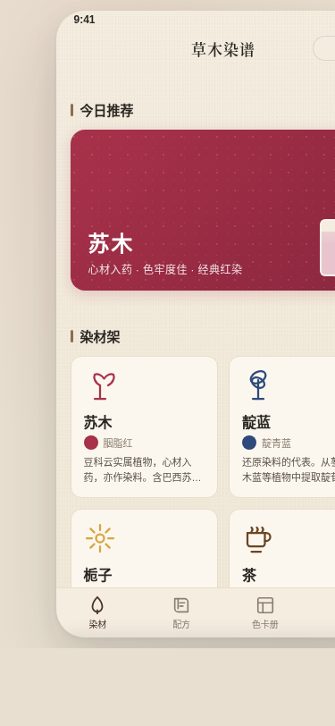

# 草木染谱 · 微信小程序

形态：微信小程序

## 简介
草木染谱是一本随身携带的植物染（草木染）配方册与染色档案微信小程序。用户浏览真实染材、查看配方与工艺步骤、拖动浸染次数游标看色阶渐深、执行一次染色并记录、把成品色样归入色卡册，日后按染材或色系复现。工具型产品，非展示页。

完整闭环：发现染材 → 了解特性/色相 → 选配方看工艺 → 拖浸染次数看色阶 → 执行染色步骤计时 → 成品入色卡册 → 色卡册按染材/色系复现。

## 签名交互
**浸染次数游标**：配方详情页大色卡下方水平游标（刻度 1–6），拖动时色卡颜色按该染材 6 级真实色阶数组从浅到深实时插值，模拟草木染"多次浸染叠色逐次加深"的真实工艺。松手 spring 吸附整数刻度，色卡旁实时显示当前 hex 与浸染次数。

## 截图

## 妙搭预览
- 预览链接：https://dcniaqwtmoca.feishu.cn/page/RNc8mDv6udZyrzabyK9cZvB6nv2
- app_id：app_17cfhk7dde4
- app_token：RNc8mDv6udZyrzabyK9cZvB6nv2

## 文件说明
- `index.html` — 单文件应用源码（纯 vanilla，CSS/JS 全内联，零外部依赖）
- `设计规范.md` — 色彩/字体/信息架构/签名交互/动效系统/工程规范
- `preview.png` — 首页截图（chromium headless 375×812）
- `README.md` — 本文件

## 技术栈
- 纯 HTML + CSS + 原生 JavaScript（vanilla single file）
- 无 React / 无 CDN / 无外部字体 / 无外部图片
- localStorage 持久化（`ranrancao_colorbook` / `ranrancao_settings`）
- 移动端 375px，微信小程序端侧交互语言 6 种（胶囊导航栏 / 底部 TabBar / 半屏弹层 / 下拉刷新 / 左滑操作 / 吸底操作栏）
- 支持 prefers-reduced-motion

## 设计要点
- **形态**：微信小程序（与上一次"信鸽竞翔·原生 App"交替）
- **配色**：天然植物染多色（苏木胭脂红 / 栀子金黄 / 靛蓝 / 茶褐 / 五倍子墨灰 / 槐米嫩绿 / 茜草 / 洋葱皮），素布底 #F4EDE0，禁蓝紫渐变陈词
- **内容**：8 种真实染材，每种含学名/产地/媒染剂/特性/真实配方/6 级色阶
- **字体**：系统无衬线 UI + 等宽数字 + 较重字重模拟宋体标题感

## 自查结论
- ✅ 完整闭环可走通（染材→配方→游标→染色计时→入册→复现）
- ✅ 截图非空白（std=59），内容真实
- ✅ 4 Tab 齐全，签名游标交互在源码中确认
- ✅ localStorage 持久化 + prefers-reduced-motion
- ✅ 纯 vanilla 单文件，零外部依赖，妙搭渲染不白屏
- ✅ 删动画后设计靠排版与色块层级仍成立；灰度下靠尺寸/留白/字重层级成立

等待协调者检查后提交 GitHub。
