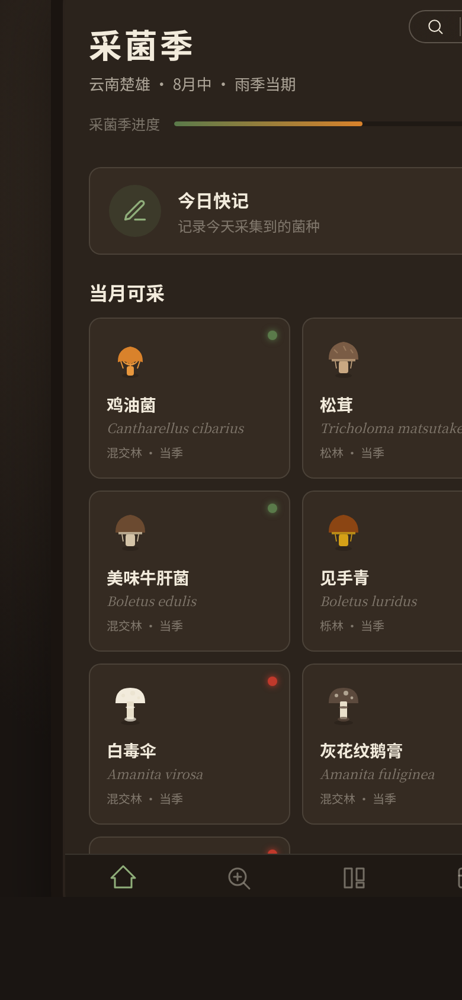

形态：微信小程序

# 菌谱志 · 野生菌采集者辨识工具

## 简介

菌谱志是一款面向野生菌采集者的微信小程序，核心功能是通过二叉检索表逐级排除定种，帮助采菌人在野外快速辨识陌生菌物并判断食毒性。辨识完成后可记入采集档案，按地图、时间线、物种统计三视图浏览历史采集记录。

**核心体验链路**：采菌季首页看当季 → 辨识检索逐级排除定种 → 食毒灯亮起（绿=可食/红=剧毒/黄=慎食）→ 物种详情半屏弹层 → 记采集 → 档案新增可看。

## 截图预览

> 首页：采菌季日历，当月可采菌种卡片 + 季节进度条 + 今日快记入口

## 妙搭预览

https://dcniaqwtmoca.feishu.cn/page/Lh38mZfD7dQeHuatz9ScTJVKnIe

## 文件说明

| 文件 | 说明 |
|---|---|
| index.html | 完整应用源码（纯 vanilla 单文件，无外部依赖） |
| 设计规范.md | 配色 / 字体 / 动效 / 交互语言 / 页面结构 / 数据模型 |
| preview.png | 首页截图（390×844 @2x） |
| README.md | 本文件 |

## 技术栈

- 纯 vanilla HTML + CSS + JavaScript（无 React / 无 CDN / 无外部依赖）
- localStorage 持久化采集记录
- CSS 变量主题化
- 支持 prefers-reduced-motion
- 微信小程序端侧交互语言（8 种）：胶囊按钮 / 自定义导航栏 / 页面栈 push/pop / 底部 TabBar / 半屏弹层 / 下拉刷新 / 左滑删除 / 吸底操作栏

## 页面结构

1. **采菌季首页** — 当月可采菌种卡片 + 季节进度 + 今日快记入口
2. **辨识检索** — 二叉检索表逐级排除定种（签名交互）
3. **物种图鉴** — 按食毒/季节浏览全部菌种
4. **采集档案** — 地图/时间线/物种统计三视图切换
5. **采集记录** — 落地点+生境+数量提交入档案
6. **设计规范页** — 从关于入口进入
7. **接口文档页** — 从关于入口进入

## 签名交互

二叉检索表逐级排除：每步对比两个形态特征选其一，候选物种实时收敛（不符合的淡出灰化）；最终剩一个物种「锁定」，食毒灯（绿/红/黄/灰）亮起脉冲，拉丁学名衬线显现。

## 内容真实性

8 种可辨识菌物含真实拉丁学名、生境、季节、产地、形态特征、相似毒菌警示、孢子印色。食毒安全声明在辨识页、物种详情页、采集记录页三处可见。

## 形态标记

**形态：微信小程序**
