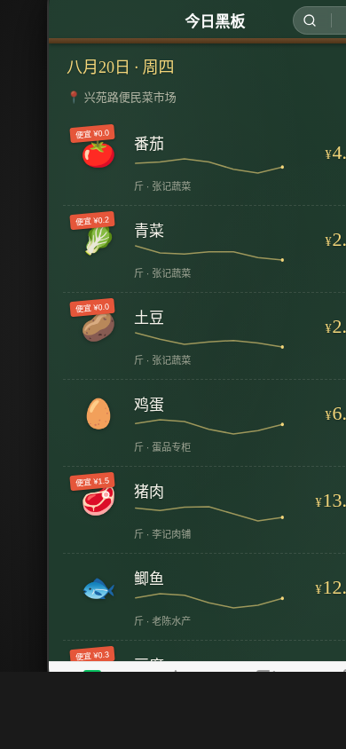

# 菜场时价黑板 · V2 手机 Mock

形态：微信小程序

## 产品简介

给常逛菜场的人一块随身手写粉笔价目黑板。菜价天天变、不标价、要张口问——用户把今天问到的实际成交价用粉笔写上黑板，攒成可看走势、可比摊位的个人菜价账本。

设计母题 = 老菜场摊位门口的手写粉笔价目黑板。

## 版本信息

- 版本：V2.0
- 形态：微信小程序
- 目标宽度：390px
- 技术栈：纯 vanilla 单文件 HTML（无 React/Babel/CDN/外部图片）

## 核心流程

打开今日黑板 → 长按菜品弹手写输入 → 粉笔写入今日价 + 摊位 → 价签更新 + sparkline 延伸 → 低于心理价时提示 → 计入今日已买 → 账本累计

## 四 Tab 结构

1. **今日黑板** — 粉笔字价签列表，长按记价
2. **价格走势** — 七日 sparkline 走势图，含心理价位参考线
3. **想买清单** — 待购清单 + 降价提醒 + 一键记为已买
4. **我的账本** — 按日分组的购买记录 + 月度统计 + 设计规范/接口文档入口

## 签名交互

长按今日黑板上的菜品条目 → 弹出半屏「黑板手写输入区」→ 输入今日价/选摊位 → 确认时数字以手写粉笔体逐笔 stroke-dashoffset 绘制落定到黑板价签 → sparkline 随之延伸一笔 → 若价低于该菜心理价则番茄红高亮提示「比心理价便宜 X 元」。

## 端侧交互（5+ 种微信小程序语言）

- 自定义导航栏 + 胶囊按钮
- 底部 4 Tab
- 半屏弹层（弹簧上升）
- 下拉刷新（弹性回弹）
- 左滑操作（删除/编辑）
- 吸底操作栏

## 真实内容

10 种真实菜品（番茄/青菜/土豆/鸡蛋/猪肉/鲫鱼/豆腐/葱姜蒜/黄瓜/河虾），带真实波动克数/斤价区间与摊位名，localStorage 持久化。

## 工程特性

- localStorage 持久化
- prefers-reduced-motion 支持（降级为即时呈现）
- RAF/定时器随可见性暂停且卸载取消
- 快速操作不叠加定时器
- 零外部 CDN 依赖
- 无蓝紫渐变

## 截图预览

## 妙搭在线预览

https://dcniaqwtmoca.feishu.cn/page/NP4YmA09Sd7aB0aw0GucvivUnrQ

## 文件说明

- `index.html` — 单文件源码（HTML + CSS + JS，纯 vanilla）
- `设计规范.md` — 视觉系统与组件规范（色彩 / 字体 / 动效 / 端侧交互）
- `preview.png` — 390×844 渲染截图
- `README.md` — 本说明

## 接口文档

见应用内「我的账本」→「接口文档」二级页，含 /api/market/price/today、/api/market/price/history、/api/market/wishlist、/api/market/account 等接口定义。
