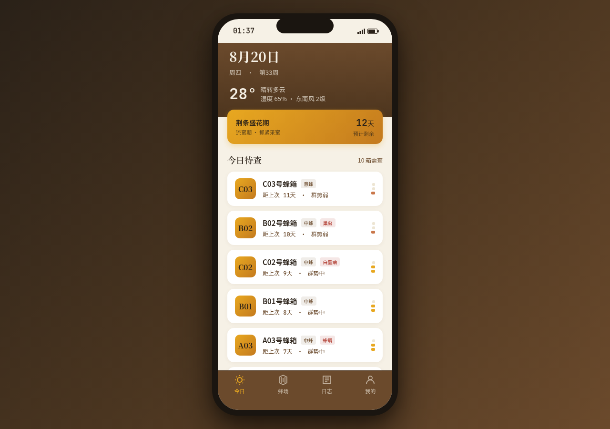

# 蜂箱志 · 养蜂人查箱与收成日志

形态：原生 App

> 方向：V2 手机 UI · 形态：原生 App · 日期：2026-08-20 · 主题：养蜂人查箱（抽脾检查）与摇蜜收成日志

## 简介

养蜂人每 5–7 天必须开箱检查一次。「蜂箱志」把这套真实高频的查箱动作做成随身工具：蜂场 → 蜂箱 → **抽脾式逐项检查**（见王 / 卵虫脾 / 蜜粉脾 / 病害）→ 措施 → **蜡封提交** → **手摇摇蜜机记批次** → 日志与统计回顾。完整 user flow：打开 → 今日待查 → 进入查箱 → 抽脾检查 → 提交 → 蜂箱状态更新 → 摇蜜 → 批次入库 → 日志回顾。所有功能真实可交互、有真实状态变化，数据 localStorage 持久化。

签名交互：① 抽脾上拉（阻尼 + 回弹）；② 摇蜜转柄（跟随手指旋转 + 松手惯性缓停 + 蜜量刻度连续上升）；③ 蜡封滴落（提交确认，取代印章）。

## 截图

## 妙搭预览

在线预览：https://dcniaqwtmoca.feishu.cn/page/ZjVLmAqjZdoip7ak9UOcSGkhnpb

## 文件说明

| 文件 | 说明 |
|------|------|
| `index.html` | 单文件应用源码（React + Babel 内联，CDN 引入字体与 React） |
| `preview.png` | chromium headless 渲染截图（1280×900） |
| `设计规范.md` | 色板 / 字体 / 动效 / 组件 / 降级规范 |

## 页面清单（8 页）

1. **今日**：日期 / 天气 / 花期提示 / 今日待查蜂箱列表（按距上次查箱天数倒序）。
2. **蜂场**：12 蜂箱总览（箱号 / 蜂种 / 群势力条 / 上次查箱 / 病害标记）→ 蜂箱详情页。
3. **查箱流程**：抽脾上拉 → 四项观察选择 → 措施标签 → 蜡封提交。
4. **摇蜜**：脾数步进器 → 手摇转柄旋转 → 蜜量刻度上升 → 选蜜种 → 批次入库。
5. **日志**：查箱 + 摇蜜统一时间线，分段筛选，左滑删除 + 撤销。
6. **我的**：蜂场档案 + 实时统计 + 设计规范 / 接口文档入口。
7. **设计规范页**：六色色板 / 三字体 / 动效系统 / 组件示例。
8. **接口文档页**：8 个 REST 接口（/api/v2/hives、/inspections、/harvests、/flowering-calendar 等），可展开请求 / 响应字段。

## 技术栈

- 单 HTML 文件，React 18 + ReactDOM（CDN），JSX 内联于 `<script type="text/babel">`，无外部 jsx 文件。
- 字体：Noto Serif SC / Noto Sans SC / JetBrains Mono（Google Fonts CDN）。
- 数据：localStorage（key `fengxiangzhi_v2_data`），首次注入真实默认数据。
- 降级：`prefers-reduced-motion`；卸载 `cancelAnimationFrame` + `removeEventListener`。

## 自查结论

- Browser QA：headless 渲染无白屏、无 Console Error / PageError；截图像素 std 70.8（非空白）。
- 核心流程：蜂场 → 蜂箱详情 → 开始查箱 / 摇蜜 真实可用；Tab 切换、分段筛选、左滑删除、设计规范 / 接口文档页均验证通过。
- 配色：蜂蜡黄 + 蜜琥珀 + 桐木棕 + 烟熏白 + 病警红，禁蓝紫渐变，与近期作品不雷同。
- 反模板：首屏为「今日待查 + 花期」，非问候语 / 搜索 / Banner 模板；无假功能。
- 已知次要项：未监听 `visibilitychange` 暂停 RAF（卸载清理已具备）；签名拖拽动效手感建议人工复核。

等待协调者检查后提交 GitHub。
