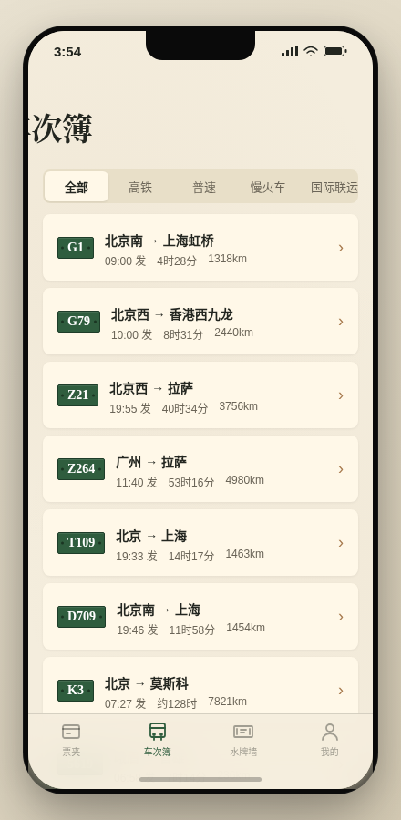

形态：原生 App

# 运转手帐 Yunzhuan Rail · 铁道运转记录 App

## 简介

火车迷的「运转」记录 App。「运转」是铁道亚文化术语——为了体验某趟列车而专程乘坐并记录。一张硬板车票 = 一次真实乘车的完整闭环：查车次 → 登记出票 → 检票钳打孔 → 票入票夹 → 点亮搪瓷水牌 → 累计运转里程。

签名交互：长按检票钳 0.6s 打孔——M 形真实镂空缺口 + 纸屑飘落 + 蓝笔 stroke-dashoffset 逐笔划线 + 票微沉转已检态，不可逆。

## 截图

## 妙搭预览

https://dcniaqwtmoca.feishu.cn/page/G7hQmwLI9dcOtfa97ilcTO8CnEd

## 文件说明

| 文件 | 说明 |
|------|------|
| `index.html` | 完整自包含 HTML 源码（CSS+JS 全内联，无外部依赖） |
| `设计规范.md` | 色板、字体、动效系统、组件清单、页面结构 |
| `preview.png` | 车次簿页截图 |
| `thumbnail.png` | 妙搭自动生成缩略图 |

## 技术栈

- 纯 HTML/CSS/JS 单文件，无框架依赖
- CSS 动画 + SVG（stroke-dashoffset 蓝笔划线、进度环）
- localStorage 持久化（键 `yunzhuan_state_v1`）
- prefers-reduced-motion 支持
- visibilitychange/pagehide 生命周期管理

## 页面清单

1. **票夹**（Tab1 首页）— 票列表 + 空状态信号灯 + 下拉刷新 + 左滑删除
2. **车次簿**（Tab2）— 10 条真实车次 + segmented 筛选（全部/高铁/普速/慢火车/国际联运）
3. **水牌墙**（Tab3）— 搪瓷水牌网格 + 点亮状态
4. **我的**（Tab4）— 四格统计（里程/次数/水牌/线路）+ 文档入口
5. **登记运转**（push）— 车站选择 + 席别 ActionSheet + 出票
6. **票详情**（push）— 硬板票 + 长按检票钳打孔
7. **车次详情**（push）— 大水牌 + 经停时刻表 + 登记入口
8. **关于**（push）— 运转文化科普
9. **设计规范**（push）— 色板/字体/动效/组件
10. **接口文档**（push）— REST API 契约

## 真实车次数据

G1（北京南→上海虹桥）、G79（北京西→香港西九龙）、Z21（北京西→拉萨）、Z264（广州→拉萨）、T109（北京→上海）、D709（北京→天津）、K3（北京→莫斯科）、5619（燕岗→普雄）、5633（普雄→攀枝花）、6063（宝鸡→广元）

## V2 形态

原生 App：iOS 状态栏 + 原生导航栏（返回箭头/大标题）+ 底部 4 TabBar + 页面栈 push/pop + Home Indicator。无微信胶囊按钮。
