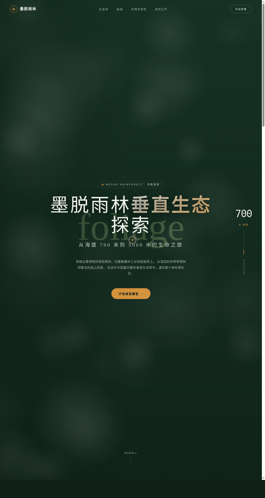

# 墨脱雨林 · 垂直生态探索 Motuo Rainforest

- 日期：2026-08-16
- 方向：网页设计（V1）
- 主题：西藏墨脱从海拔 700m 到 5000m 的垂直生态带沉浸式自然探索官网

## 简介

一件艺术品级的单页自然探索官网：以海拔为纵轴，从热带季雨林一路攀到高山苔原。Hero 区雨林全景配随滚动实时跳动（700m→5000m）的海拔计数器；4 张 3D 倾斜卡片展示垂直生态带；瀑布秘境视差 + 引言打字机；异形网格物种卡；弹簧缓动数字统计；48 条有机波动的频谱条模拟自然之声；末尾磁性吸附 CTA。深松绿 + 雾白骨架 + 琥珀单一高饱和锚点，衬线大标题呼应博物气质。

## 截图

## 动效亮点

- 自定义三环光标（弹簧 Hooke + 双层阻尼），开页即居中显示
- 卡片 3D 倾斜（反平方磁引力 + 弹簧）
- 海拔 / 统计数字弹簧积分计数
- 漂浮雾气粒子（正弦漂移 + 包裹循环）
- 多频正弦叠加的频谱可视化（非整齐划一）
- 磁性吸附按钮 + 光泽扫过
- IntersectionObserver 错位渐入

## 妙搭在线预览

https://dcniaqwtmoca.feishu.cn/page/OaB9mGhxedtYlVaSd3AcMbcKnSc

## 文件说明

| 文件 | 说明 |
|------|------|
| index.html | 完整可运行源码（React + Babel 内联，单文件） |
| 设计规范.md | 色彩 / 字体 / 组件 / 动效 / 页面结构 |
| preview.png | 页面截图 |

## 技术栈

React 18 + Babel standalone（全部内联在 `<script type="text/babel">`），无外部 JSX 文件。
