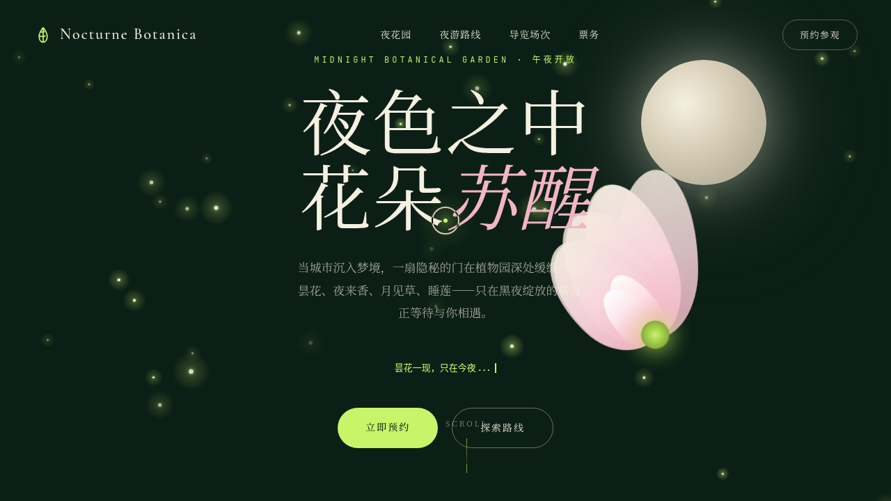

# 夜间植物园 Nocturne Botanica

- **日期**：2026-08-16
- **方向**：V1 网页设计
- **主题**：夜间植物园——一座只在午夜开放的植物园沉浸式官网
- **配色**：深夜墨绿 `#0C1F16` + 萤火黄绿 `#C8F46A` + 昙花淡粉 `#F2B5C6` + 月光米白 `#F5F0E1`（夜色绿系，无蓝紫渐变）

## 简介

一座只在午夜开放的植物园的沉浸式单页官网。围绕夜间开花植物（昙花、夜来香、月见草、睡莲）、夜游路线与导览场次组织内容。萤火虫在墨绿夜色中漂浮，昙花随月光呼吸开合，藤蔓沿滚动生长——所有动效均基于物理模型或植物夜行语义。

## 截图

## 动效亮点

- 萤火虫粒子系统（40 只，wander 转向 + 摩擦限速 + 呼吸辉光）
- 昙花绽放（10 片花瓣错落呼吸，花心脉动）
- 月光多层脉动 + 视差滚动
- 藤蔓生长路径（stroke-dashoffset 随滚动实时绘制）
- 自定义光标（白环 + 萤火内点 + 三态 + 涟漪）
- CTA 脉冲环 + 20 颗粒子抛物线爆发
- 共 14 项组件级特效

## 妙搭在线预览

https://dcniaqwtmoca.feishu.cn/page/FilZmItbldewCDah1hacbPjunjf

## 文件说明

| 文件 | 说明 |
|---|---|
| `index.html` | 完整可运行源码（纯 vanilla 单文件，零外部依赖） |
| `thumbnail.png` | 页面预览截图 |
| `设计规范.md` | 色彩系统、字体、组件、动效规范 |

## 技术栈

纯 HTML / CSS / JavaScript（vanilla，无 React / Babel / CDN 依赖）
