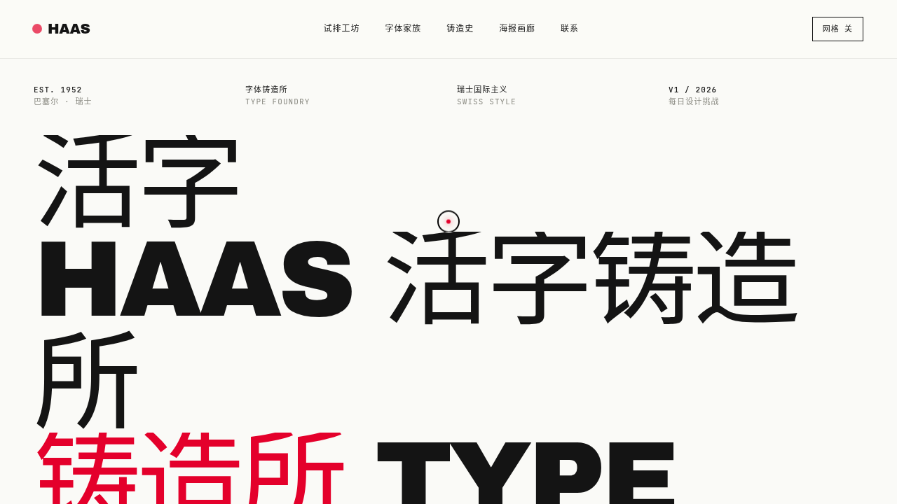

# 字体铸造所 Type Foundry · 网页设计 Mock

- 日期：2026-08-16
- 方向：V1 网页设计
- 主题：瑞士国际主义排版风的活字铸造所官网 —— 活字铸造 × 网格系统 × 字体试排

## 简介

一个真实可交互的完整网站：巨型排版 Hero、字体试排工坊（实时切换字体家族 / 字号 / 字重 / 字距 / 对齐）、字体家族陈列、可开关的 12 列网格系统、铸造工艺编年时间轴、海报画廊、数据统计与磁吸 CTA。纸白 + 信号红 + 墨黑的瑞士海报气质，大面积留白与红黑强烈对比。

## 截图

## 动效亮点

- 自定义光标：弹簧跟随 + 悬停放大 + 点击涟漪
- 字体试排工坊：实时排版参数响应
- 3D 卡片倾斜：鼠标位移物理插值
- 磁性 CTA 按钮：反平方引力吸附 + 光泽扫过
- 打字机 Hero、数字计数 easeOutExpo、海报惯性视差、跑马灯页脚
- 共 14 项组件级特效，`prefers-reduced-motion` 全量降级

## 妙搭在线预览

https://dcniaqwtmoca.feishu.cn/page/NTAymoyVNddEOHat5JFcbxUrnxh

## 文件说明

| 文件 | 说明 |
|---|---|
| index.html | 完整可运行源码（HTML + 内联 CSS + 内联 JSX） |
| 设计规范.md | 色彩 / 字体 / 组件 / 动效 / 页面结构规范 |
| preview.png | 页面截图 |
| thumbnail.png | 平台生成缩略图 |

## 技术栈

纯前端单文件：HTML + 内联 CSS + 内联 Babel JSX（`<script type="text/babel">`），无外部 JSX 引用。
