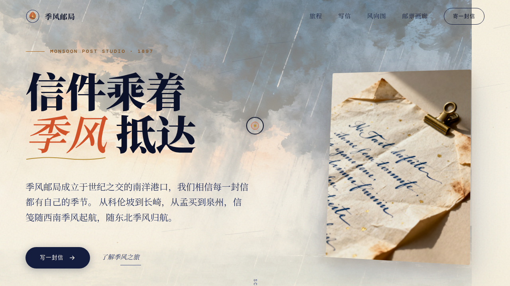

# 季风邮局 Monsoon Post

- 日期：2026-08-16
- 方向：网页设计（V1）
- 主题：虚构南洋季风邮政工作室品牌站——信件乘着季风跨洋送达

## 简介
单页沉浸式卷轴叙事网站，含 Hero、季风之旅四段叙事、写信室（打字机信纸）、风向航线图（Canvas 动态航线）、邮票画廊、火漆封印宣言区与页脚。围绕季风与书信主题组织内容、视觉与动效。

## 截图

## 动效亮点
- 自定义光标：弹簧跟随 + 白粗环 + 彩色内点 + 多层发光 + 三态 + 涟漪
- 全球粒子风层：风向流动 + 纸屑飘落 + 正弦漂移
- 信纸 3D 倾斜（摩擦积分器）+ 打字机变速
- 磁吸引按钮（反平方引力 + 回弹阻尼）
- 航线 Canvas 风脉正弦波 + 港口脉冲
- 14+ 组件级特效，均基于物理/语义模型

## 文件说明
| 文件 | 说明 |
|------|------|
| index.html | 完整可运行源码（含内联 CSS/JSX） |
| 设计规范.md | 色彩/字体/组件/动效/页面结构 |
| preview.png | 页面截图 |

## 妙搭在线预览
https://dcniaqwtmoca.feishu.cn/page/VGj5mg7xTdxgEkaZGSqc0aWCnAh

## 技术栈
HTML + 内联 CSS + React (Babel standalone 内联 JSX)，零外部 JSX 文件。
