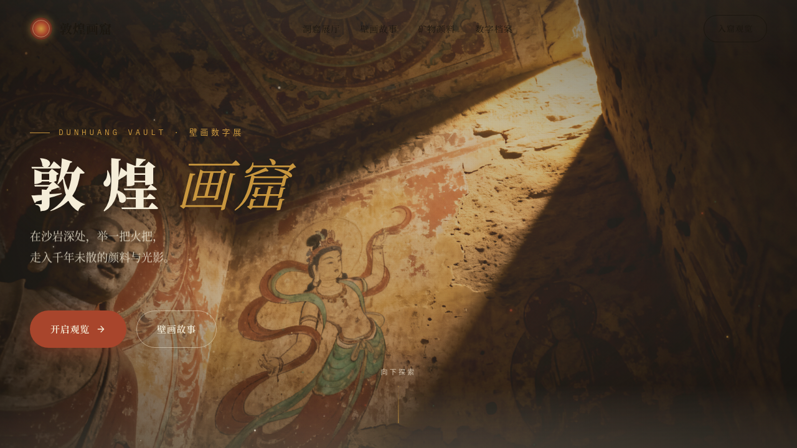

# 敦煌画窟 Dunhuang Vault · 壁画数字展

> Arc 每日设计 Mock · 2026-08-16 · V1 网页设计

## 基本信息

- **日期**：2026-08-16
- **版本**：V1
- **方向**：网页设计（真实可交互的完整网站）
- **主题**：敦煌画窟 Dunhuang Vault —— 敦煌壁画数字展沉浸式单页官网
- **配色**：沙金米 `#E9DCC3`（底）+ 赭石红 `#A8452C` + 石绿 `#3E6B50` + 墨黑 `#1C1710`，壁画矿物颜料质感，无蓝紫渐变
- **字体**：Noto Serif SC（碑刻展示）+ 霞鹜文楷 LXGW WenKai（写经正文）+ IBM Plex Mono（古今数字标签）

## 设计说明

围绕「洞窟纵深」组织叙事：Hero 洞窟入口 → 洞窟展厅（7 座洞窟错落网格）→ 壁画故事（4 则 Tab 切换）→ 矿物颜料色谱 → 数字档案统计 → 藻井引言。自定义光标语义化为「火把光晕」，滚动驱动洞窟纵深视差推进，整体追求矿物壁画的颗粒质感与沉静仪式感。

## 交互说明

- 自定义「火把光晕」光标：开页即居中显示，悬停可交互元素三态切换，点击涟漪
- 洞窟卡片 3D 磁性倾斜 + 高光扫过
- 壁画故事 Tab 可切换，滑入过渡
- 矿物颜料色谱悬停发光呼吸
- 导航随滚动收缩

## 动效原理（13 个组件级特效）

火把光标（惯性 + 焰心跳动 RAF 积分）/ 矿物粉尘粒子（重力 + 空气阻力终端速度）/ 洞窟纵深视差 / 卡片 3D 磁性倾斜 + 高光扫过 / 滚动渐入（模糊 + 位移）/ 弹簧数字计数 / 打字机（随机节拍）/ 藻井多层反向旋转 / 颜料悬停发光呼吸 / 导航滚动收缩 / 滚动指示光点 / Tab 切换滑入 / 点击涟漪扩散。RAF 统一注册，`visibilitychange` 自动暂停/恢复，`prefers-reduced-motion` 全量降级。

## 截图



## 在线预览

https://dcniaqwtmoca.feishu.cn/page/PaA9mFO7FdlG87aHcHHcfLFKnbg

## 文件结构

```
2026-08-16_敦煌画窟_dunhuang-vault/
├── index.html      # 入口
├── styles.css      # 样式
├── js/             # 交互脚本
├── preview.png     # 截图
└── README.md
```

## 本地运行

```bash
cd 2026-08-16_敦煌画窟_dunhuang-vault
python3 -m http.server 8090
# 浏览器打开 http://127.0.0.1:8090
```
