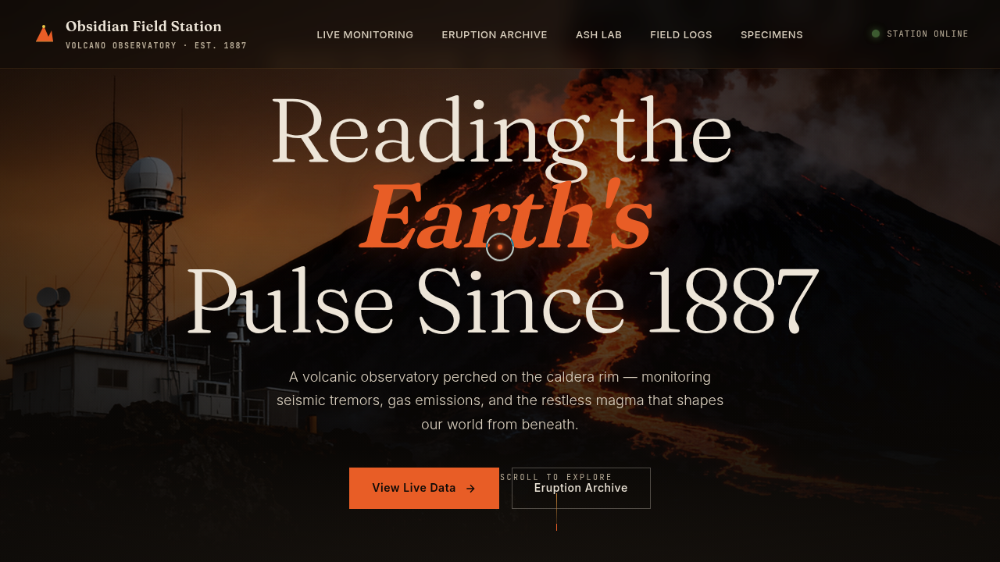

# 火山观测所 Obsidian Field Station

> 2026-08-16 · V1 网页设计 · 网页 mock

## 主题

「火山观测所 Obsidian Field Station」——一座火山地质观测站的沉浸式单页官网。围绕实时地震波形监测、喷发档案时间线、火山灰扩散实验、观测员日志与岩石标本陈列组织内容与视觉，玄武岩质感暗调 + 熔岩橙张力。

## 简介

单页沉浸式官网，深炭黑底色叠加熔岩橙数据高亮。核心交互区 Live Monitoring 用 Canvas 实时绘制地震波形仪、倾斜仪气泡与气体频谱柱；Ash Dispersion Lab 提供四档强度可切换的火山灰粒子场；Eruption Archive 为交替式喷发时间线。所有按钮/卡片/切换均可真实交互。

## 截图

## 动效亮点

- 自定义光标：白环 + 熔岩橙内点 + 多层发光，悬停放大变色、点击涟漪
- 地震波形仪：多频正弦叠加 + 随机微震 spike + RMS 震级计算
- 火山灰粒子场：重力 + 风力 + 正弦摆动，四档强度切换
- 卡片 3D 倾斜 + 反平方磁性引力 + 光泽扫过
- 共 15 项组件级特效，均基于物理/主题语义

## 妙搭在线预览

https://dcniaqwtmoca.feishu.cn/page/YO7BmAIqrdFrLnaRzUUcm5NBnkg

## 文件说明

| 文件 | 说明 |
|---|---|
| index.html | 完整可运行源码（React + Babel 内联，单文件） |
| 设计规范.md | 色彩系统、字体、组件、动效、页面结构 |
| thumbnail.png | 页面截图 |

## 技术栈

React 18 + Babel Standalone（CDN），JSX 全内联，Canvas 2D。
