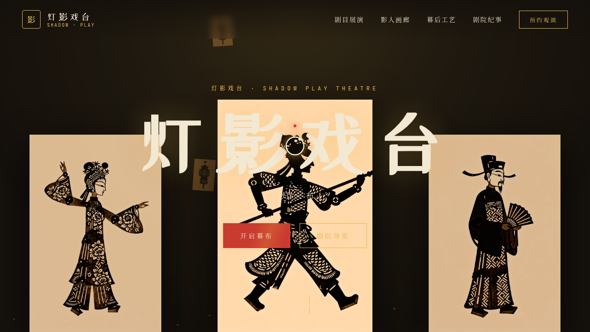

# 灯影戏台 Shadow Play · 皮影戏数字剧院

- 日期：2026-08-16
- 方向：V1 网页设计
- 主题：把中国皮影戏做成沉浸式数字剧院体验的单页网站
- 配色：墨黑 #14100C + 朱红 #C93B2E + 暖金 #E8B84B + 宣纸米 #F3E9D2

## 简介

「灯影戏台」是一座幕布后的数字剧院。开场幕布左右拉开，三尊皮影剪影随鼠标视差浮动；剧目展演呈现白蛇传 / 三打白骨精 / 空城计三台好戏；影人画廊按人物 / 神怪 / 器物分类展示皮偶；幕后工艺用六道工序环形图解构皮影制作；剧院纪事以数字计数回顾上演场次。点击皮鼓按钮触发开幕涟漪。

## 截图

## 动效亮点

自定义光标（弹簧跟随 + 暖金内点 + 涟漪）、浮动灯笼粒子、金光尘埃、幕布透光呼吸、开场幕布拉开、Hero 皮影视差、剧目卡 3D 倾斜、滚动渐入、打字机副标题、数字计数、皮鼓涟漪、影人卡悬停发光、工艺环多层旋转、主按钮光泽扫过、导航下划线展开。

## 妙搭在线预览

https://dcniaqwtmoca.feishu.cn/page/Of5vmEiIUdMkpQacGSKcrFJ2nof

## 文件说明

| 文件 | 说明 |
|---|---|
| index.html | 完整可运行源码（JSX/CSS 全内联） |
| 设计规范.md | 色彩系统、字体、组件、动效、页面结构 |
| preview.png | 页面截图 |

## 技术栈

React 18 + Babel standalone（JSX 全内联）+ 原生 Canvas / RAF 动效。运行于妙搭 html 应用。
