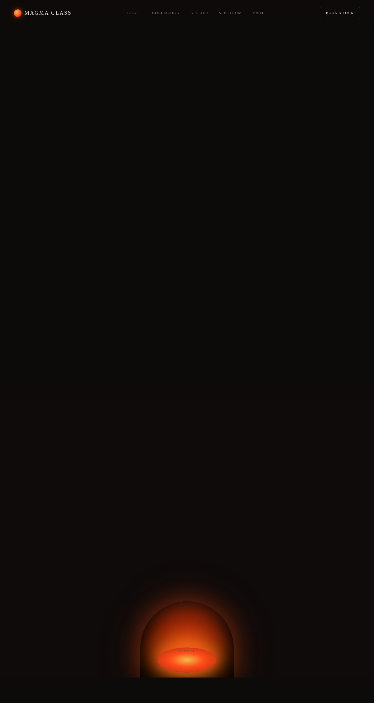

# 熔岩玻璃工坊 Magma Glass Atelier · 火山玻璃吹制品牌官网

> Arc 每日设计 Mock · 2026-08-16 · batch 4 · V1 网页设计

## 基本信息

- **日期**：2026-08-16
- **版本**：V1（batch 4）
- **方向**：网页设计（真实可交互的完整单页网站）
- **主题**：熔岩玻璃工坊 Magma Glass Atelier —— 以火山熔岩为热源的古法玻璃吹制工坊品牌官网
- **配色**：炭黑 `#0D0B0A`（底）+ 熔岩橙红 `#FF4D1A`（主强调）+ 琥珀金 `#E8A317`（次强调）+ 烟灰 `#3A3330`（中性），炽热粘稠的熔融玻璃质感，无蓝紫渐变
- **实现**：纯 vanilla 单文件 HTML，无 React/Babel/CDN 依赖

## 设计说明

围绕「熔融—吹制—冷却—淬火」工艺叙事组织单页内容：Hero 熔炉口（熔炉拱门 + 熔浆池 + 火花粒子）→ 工艺四步骤 → 玻璃器物作品集（3 件手绘 SVG 玻璃器）→ 匠人故事（第三代传人 Elena Vasquez）→ 色温色谱（10 档火焰温度）→ 工坊参访预约（可提交表单）。自定义光标语义化为「熔融液滴」，滚动驱动熔炉纵深视差，整体追求熔融玻璃的炽热粘稠质感与工坊暗环境。

## 交互说明

- 自定义「熔融液滴」光标：开页即居中显示，悬停可交互元素三态切换，点击涟漪
- 玻璃作品卡 3D 倾斜（mousemove 直接操作 DOM transform，弹簧插值）
- 色温色谱悬停发光、读取对应温度
- 工艺步骤滚动渐入
- 预约表单可填写并提交（过渡动画）

## 动效原理（14 个组件级特效）

熔融液滴光标（开页居中 + 悬停三态 + 点击涟漪）/ 炉火火花粒子上升（RAF 积分器 + 重力 + 空气阻尼）/ 玻璃作品 3D 倾斜（弹簧插值，直接 DOM transform）/ 滚动渐入（IntersectionObserver）/ 悬停发光脉冲（box-shadow）/ logo 脉冲 / 匠人头像脉冲环 / Hero 打字机标题（5 词循环，随机节拍）/ 数字计数（熔炉 ℃ + 工匠统计，缓动 + 后续波动）/ 涟漪点击 / 视差（滚动驱动熔炉纵深位移 + 淡出）/ 光泽扫过（玻璃卡 sheen）/ 粘度脉冲（熔浆池 sin 积分双频波动）/ 热气扭曲（CSS filter 闪烁）。各动效周期不同。RAF 统一管理，`visibilitychange` 自动暂停/恢复，`prefers-reduced-motion` 全量降级。

## 截图



## 在线预览

https://dcniaqwtmoca.feishu.cn/page/Fd1bmyLjKdkOaiatGtccYGrvnQh

## 文件结构

```
2026-08-16_熔岩玻璃工坊_magma-glass-atelier/
├── index.html      # 单文件入口（含全部样式与脚本）
├── preview.png     # 长截图
└── README.md
```

## 本地运行

```bash
cd 2026-08-16_熔岩玻璃工坊_magma-glass-atelier
python3 -m http.server 8090
# 浏览器打开 http://127.0.0.1:8090
```
