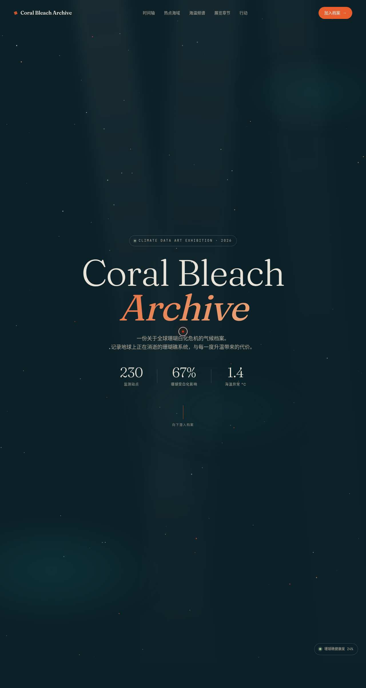

# Coral Bleach 珊瑚白化档案展 — 气候数据艺术展官网

> 2026-08-16 · 网页设计

## 简介

以全球珊瑚白化危机为题的气候数据艺术展官网。单页滚动叙事，从海床视差出发，经白化时间轴、热点海域交互地图、海温频谱条，到展览章节与行动呼吁，构建一条「深海档案 → 危机感知 → 行动」的视觉路径。深海墨青基底 + 白化珊瑚白 + 警示橙红，所有动效围绕海洋物理与声纳语义设计。

## 截图

## 文件说明

| 文件 | 说明 |
|------|------|
| `index.html` | 单页结构（双击即可打开预览） |
| `styles.css` | 全部样式与动画 keyframes |
| `main.js` | 交互逻辑（视差、频谱、计数、光标、地图切换等） |

## 动效亮点

- 自定义光标：弹簧跟随 + 悬停放大 + 点击涟漪，开页即居中显示
- 海床三层视差 + 光柱呼吸摆动 + 水下粒子漂浮（鼠标排斥）
- Hero 文字渐入 + 渐变流动 + 数字计数（easeOutExpo）
- 白化时间轴四阶段滚动渐入
- 热点海域可交互 SVG 世界地图 + 海域卡片点击切换高亮 + 脉冲圈错相位
- 海温频谱条 48 段实时振荡 + 读数跳动（声纳语义）
- 展览章节 3D 倾斜卡片（弹簧阻尼）+ 打字机状态浮标
- CTA 光泽扫过 + 脉冲发光点 + logo 旋转脉冲

## 健壮性

所有 RAF / setTimeout 统一管理，`visibilitychange` 自动暂停，`prefers-reduced-motion` 全局降级，鼠标事件直接操作 DOM transform，滚动用 rAF 节流。

## 在线预览

妙搭应用链接：https://dcniaqwtmoca.feishu.cn/page/JNaAmpjOcdKewWa6kITctWc0nGg

## 技术栈

纯 HTML + CSS + JavaScript，无框架依赖。
