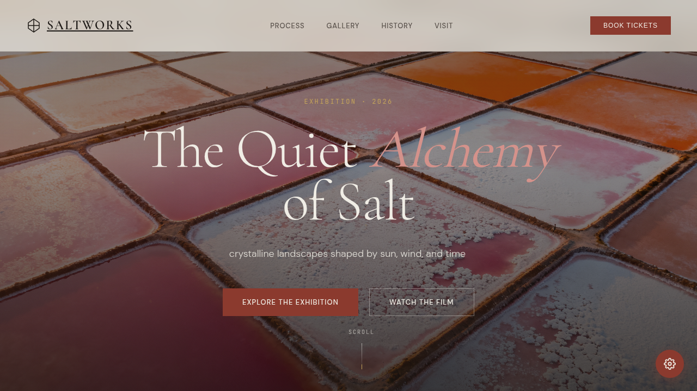

# 盐田 Saltworks — 海盐工艺展览官网

> **日期**: 2026-08-16  
> **方向**: V1 网页设计  
> **主题**: 海盐制作工艺与盐田景观展览官网

## 简介

「The Quiet Alchemy of Salt」— 一个展现海盐从卤水到结晶完整工艺流程的展览官网。页面包含航拍盐田景观、四步制盐工艺、作品画廊、盐文化历史时间线及展览参观信息。

## 动效亮点

- 三环弹簧自定义光标（外框 damped spring + 内点紧随 + 金色光晕）
- Canvas 盐晶粒子系统（漂浮 + 滚动视差 + 结晶呼吸脉动）
- 3D 卡片倾斜（damped spring 积分）
- 磁吸按钮（反平方引力模型）
- 打字机效果（随机抖动速度）
- 滚动驱动数字计数（easeOutCubic）
- 盐结晶生长动画（工艺卡片悬停）
- 时间线脉冲环（悬停扩散）
- 光泽扫过（按钮 hover 光带）
- 滚动渐入（IntersectionObserver 分级延迟）

## 文件说明

| 文件 | 说明 |
|------|------|
| `index.html` | 完整源码（内联 CSS + JS） |
| `设计规范.md` | 色彩系统、字体、组件、动效规范 |
| `preview.png` | 页面截图 |
| `thumbnail.png` | 缩略图 |

## 在线预览

[盐田 Saltworks 妙搭应用](https://dcniaqwtmoca.feishu.cn/page/C4HZmsR5cdksPeaekJ1c4AafnLd)

## 技术栈

单文件 HTML（内联 CSS + JavaScript）、Canvas 2D 粒子系统、CSS 变量主题、IntersectionObserver、prefers-reduced-motion 降级
