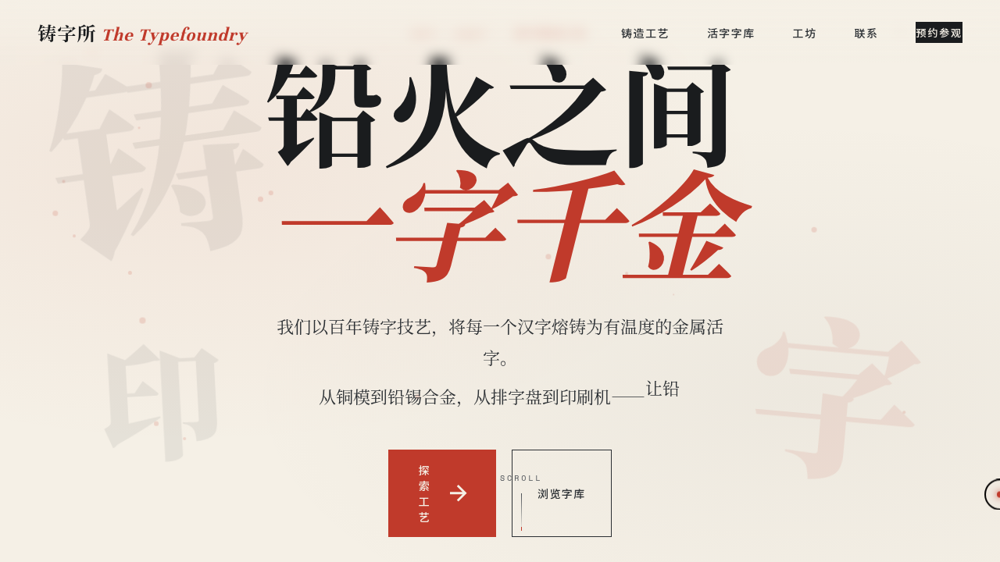

# 铸字所 The Typefoundry · 活字铸造工坊官网

> 每日设计 Mock · 2026-08-16 · Batch 6 · V1 网页设计

## 主题

「铸字所 The Typefoundry」——一间百年古法活字铸造工坊的品牌官网。围绕铅锡合金、油墨、棉纸、木排字盘的手工质感组织内容与视觉，以铅字的立体视差、油墨晕染、金属光泽扫过为签名动效。

## 配色

铅灰 `#2B2F33` · 朱砂红 `#C03A2B` · 米白纸色 `#F5F0E6` · 油墨黑 `#1A1C1E`
（严格禁蓝紫渐变）

## 字体

展示字 Unna · 正文 Noto Serif SC · 数据 Space Mono，三层排印质感。

## 页面结构（7 屏单页官网）

Hero 主视觉 → 六道铸字工艺 → 活字标本集 → 工坊数据 → 字体珍藏（Tab 切换 4 套字库）→ 铸字师引言 → 联系与预约表单 → 页脚

## 交互说明

- 顶部导航随滚动收缩（阴影 + 高度变化）
- 工艺卡片可 3D 倾斜悬停
- 字体珍藏 Tab 切换 4 套字库（淡出淡入 + 错峰延迟）
- CTA 点击触发油墨晕染径向扩散过渡
- 联系表单提交：加载态 → 成功态
- 工具栏「风格」面板可调配色 / 密度 / 字体 / 动效开关

## 动效原理说明（17 个组件级特效）

1. 自定义光标：Hooke 弹簧跟随，悬停放大变色三态切换，点击涟漪，开页即显示在屏幕中央
2. 浮动墨点粒子：布朗运动 + 鼠标反平方磁引力 + 近距离排斥 + 阻尼
3. 滚动渐入：IntersectionObserver + 分级延迟
4. 巨型活字视差：惯性阻尼滚动驱动
5. 工艺卡片 3D 倾斜：弹簧阻尼插值，直接操作 DOM transform
6. 打字机：Hero 副标题 4 句循环
7. 数字计数：easeOutCubic，工坊数据四项
8. 频谱条装饰：正弦波 + 不同相位/振幅
9. 字体分类 Tab 切换：淡出淡入 + 错峰
10. 油墨晕染过渡：CTA 径向扩散
11. 光泽扫过：活字标本卡 hover
12. 脉冲徽标：「开放中」状态指示
13. 滚动提示线动画
14. 表单提交交互（加载 → 成功）
15. 导航滚动收缩
16. 活字标本行 hover 横向微偏移
17. 按钮光泽扫过

物理模型：弹簧 Hooke 定律、反平方磁引力、阻尼摩擦、RAF 积分器统一调度；周期各异、不整齐划一。支持 `prefers-reduced-motion` 降级，移动端隐藏自定义光标回退原生交互。

## 截图



## 在线预览

https://dcniaqwtmoca.feishu.cn/page/Mq6dmXYW2dP4dfaDAAUccKTYnSc

## 文件结构

```
2026-08-16_铸字所_typefoundry/
├── index.html              # 单页官网主文件（52K）
├── effects.js              # 动效逻辑（23K）
├── tweaks.jsx              # Tweaks 面板
├── components/
│   └── tweaks-panel.jsx
└── preview.png
```

## 本地运行

直接用浏览器打开 `index.html`，或：

```bash
python3 -m http.server 8080
# 访问 http://localhost:8080/index.html
```
