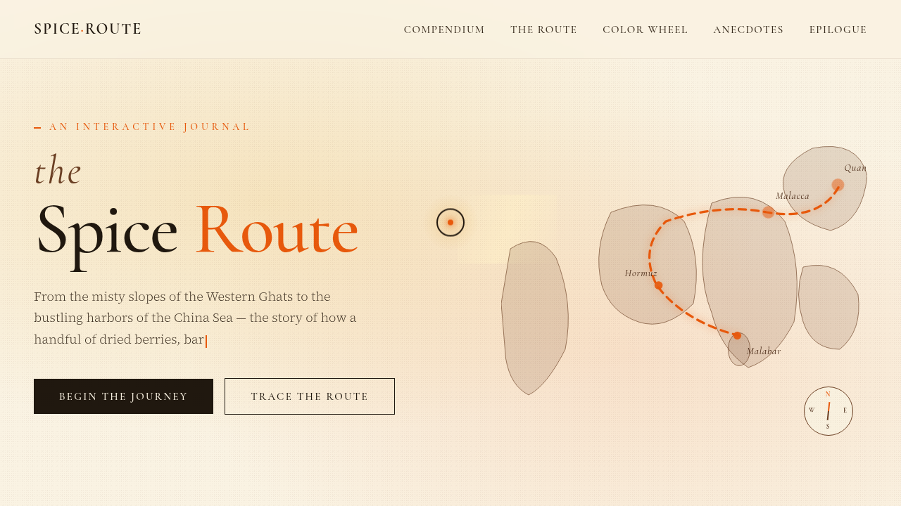

# 香料之路 The Spice Route · V1 网页设计

- 日期：2026-08-16
- 方向：V1 网页设计
- 主题：从马拉巴尔海岸到泉州港的香料贸易之旅——单页滚动叙事互动杂志
- 配色：藏红花橙 #E8590C + 肉桂深棕 #6B3F23 + 豆蔻奶白 #FAF3E3 + 姜黄金 #E9B44C + 胡椒墨黑 #20180F

## 简介

「香料之路」是一份艺术品级的单页互动杂志网站，围绕真实香料贸易历史组织内容：8 种香料（藏红花 / 肉桂 / 小豆蔻 / 姜黄 / 黑胡椒 / 丁香 / 肉豆蔻 / 八角）的图鉴、6 个港口的贸易航线、可旋转的气味色轮、数字轶事。所有板块真实可交互。

## 动效亮点

- 自定义光标：白环 + 藏橙内点 + 三层发光，悬停三态变形，点击涟漪
- 滚动驱动 SVG 航线绘制 + 商船沿路径行进
- 可拖拽气味色轮（惯性阻尼 + 自动缓转）
- 香料卡片 3D 倾斜 + 光泽扫过
- 漂浮香料粒子（正弦摆动）+ 纸纹颗粒
- 数字计数、打字机、罗盘摆动等共 14 个组件级特效

## 妙搭在线预览

https://dcniaqwtmoca.feishu.cn/page/BnoLmPZLbdqj7PaRuKRcYOd5nZf

## 截图

## 文件说明

| 文件 | 说明 |
|---|---|
| index.html | 完整源码（JSX/CSS 全内联） |
| thumbnail.png | 页面截图 |
| 设计规范.md | 色彩/字体/组件/动效规范 |

## 技术栈

React 18 + Babel standalone（JSX 全内联）+ 原生 RAF 动效，运行于妙搭 html 应用。
