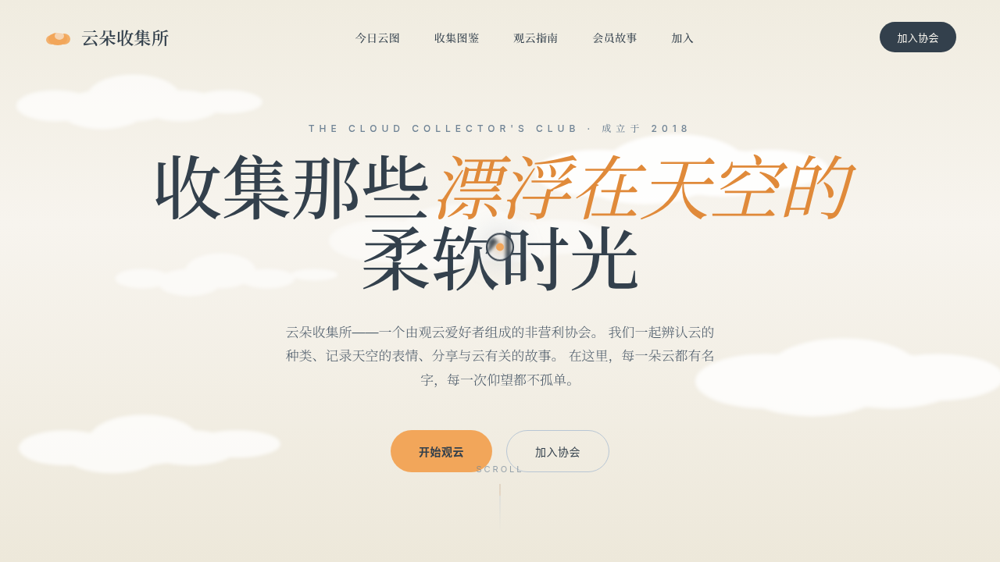

# 云朵收集所 The Cloud Collector's Club

> 日期：2026-08-17 ｜ 方向：V1 网页设计 ｜ 主题：观云爱好者协会官网

## 简介

一个观云爱好者协会的官方网站——围绕「收集云、记录云、分享云」的真实可交互完整网站。浅色低饱和的云白 + 雾灰蓝 + 杏桃橙配色，搭配衬线标题营造手账博物气质。所有按钮、卡片、导航、筛选、表单均可交互。

## 动效亮点

- 自定义光标：白环 + 杏色内点 + 薄雾尾迹，悬停放大、点击涟漪
- Hero 三层云层视差滚动（滚动驱动云量变化）
- 粒子云聚散系统（60 粒子 + 鼠标磁性反平方引力）
- 卡片 3D 倾斜 + 光泽扫过
- 数字计数 / 打字机 / 滚动渐入 / 头像脉冲等共 14 个组件级特效

## 文件说明

| 文件 | 说明 |
|------|------|
| index.html | 完整可运行源码（HTML/CSS/JSX 全内联） |
| 设计规范.md | 色彩、字体、组件、动效、页面结构规范 |
| thumbnail.png | 页面截图 |

## 妙搭在线预览

https://dcniaqwtmoca.feishu.cn/page/WmZ5m6KU1duG5CaBzwrcnFS4nRP

## 技术栈

单文件 HTML，内联 CSS + 内联 JSX（Babel standalone），无外部 src 引用。
