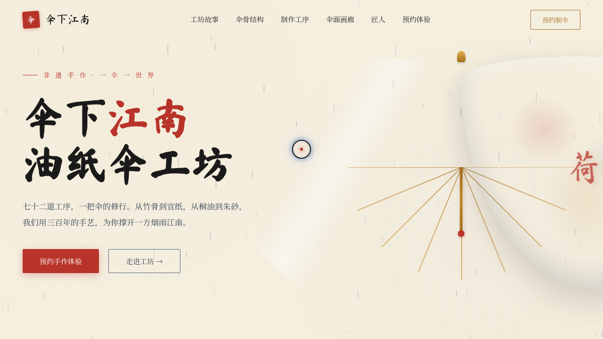

# 伞下江南 · 油纸伞工坊官网

> 日期：2026-08-17 · 方向：V1 网页设计 · 主题：油纸伞非遗工坊品牌官网

## 简介

一个油纸伞非遗工坊的品牌官网，围绕「选竹 / 削骨 / 裱纸 / 上桐油 / 绘花」五道大工组织内容，含工坊故事、伞骨结构交互拆解、伞面画廊、匠人团队与预约体验。宣纸米白底 + 桐油琥珀金 + 黛青 + 朱红点缀，呈现江南烟雨的纸伞质感。

## 截图

## 动效亮点

- 自定义光标：白环 + 朱红内点 + 多层发光，悬停三态切换，点击涟漪
- 雨滴粒子系统：80 滴 RAF 驱动，落地生成涟漪
- Hero 油纸伞 3D 倾斜：弹簧阻尼 lerp 跟随光标
- 竹骨生长动画：stroke-dasharray 描绘
- 加载遮罩：伞面展开动画
- 数字计数 easeOutExpo 缓动、伞面光泽扫过、滚动视差漂浮等共 16 个组件级特效

## 妙搭在线预览

https://dcniaqwtmoca.feishu.cn/page/CmdPmNf4JdlNXvaGxUNczJ0rnJf

## 文件说明

| 文件 | 说明 |
|---|---|
| index.html | 完整可运行单页源码（CSS/JS 内联） |
| 设计规范.md | 色彩系统、字体、页面结构、动效、健壮性 |
| thumbnail.png | 页面截图 |
| README.md | 本说明文件 |

## 技术栈

纯 HTML/CSS/JavaScript 单文件，无框架依赖，IntersectionObserver + requestAnimationFrame 驱动动效。
